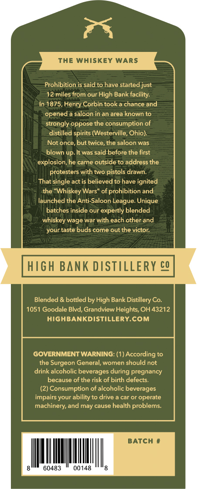
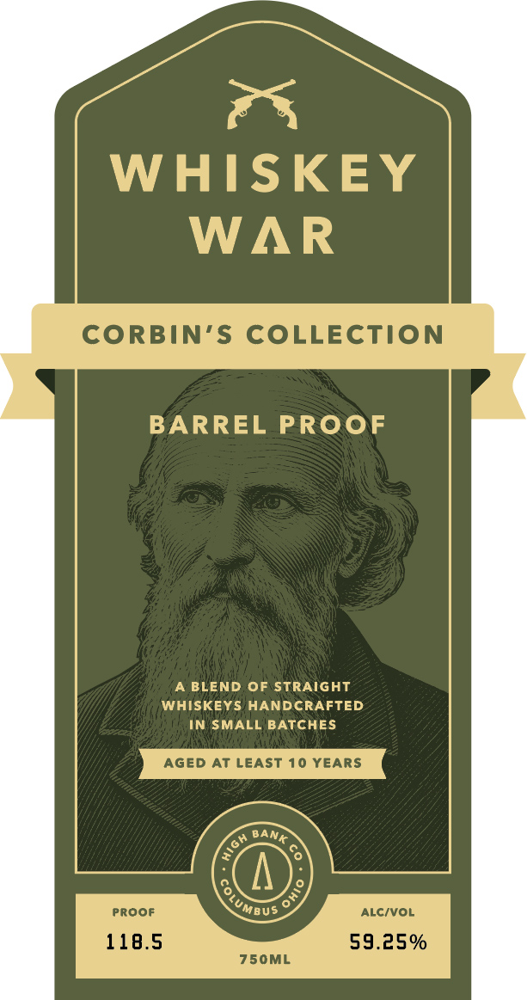

# TTB COLA Label Images - TTBID 26131001000737

**Brand Name:** WHISKEY WAR

**Fanciful Name:** BARREL PROOF

**Issue Date:** 05/15/2026

**Origin Code:** 09

**Product Class/Type:** 129

**Source:** [TTB Public COLA Registry](https://ttbonline.gov/colasonline/viewColaDetails.do?action=publicFormDisplay&ttbid=26131001000737)

## Label Images

### Back Label

### Label 1

## Extracted Label Text

*Text extracted via OCR - may contain errors*

**Detected Proof:** 118.5
**Detected Age:** 10 Years

### Back Label

The Whiskey WARS
Prohibition is said to have started just
12 miles from our High Bank facility:
In 1875, Henry Corbin took a chance and
opened a saloon in an area known to
strongly oppose the consumption of
distilled spirits (Westerville, Ohio):
Not once, but twice, the saloon was
up
It was said before the first
explosion, he came outside to address the
protesters with two pistols drawn:
That single act is believed to have ignited
the "Whiskey Wars" of prohibition and
launched the Anti-Saloon League. Unique
batches inside our expertly blended
whiskey wage war with each other and
your taste buds come out the victor
HIGh BANK DISTLLERY cQ
Blended & bottled by High Bank Distillery Co.
1051 Goodale Blvd, Grandview Heights, OH 43212
HIGHBANKDISTILLERY.Com
GOVERNMENT WARNING: (1) According to
the
Surgeon General, women should not
drink alcoholic beverages during pregnancy
because of the risk of birth defects,
(2) Consumption of alcoholic beverages
impairs your ability to drive
car or operate
machinery; and may cause health problems:
BATCH
60483
00148
blown '

### Label 1

WHISKEY
WAR
CORBIN'S COLLECTION
BARREL PROOF
BLEND OF STRAIGHT
WHISKEYS HANDCRAFTED
IN SMALL BATCHES
Aged At LEAST 10 YEARS
proof
ALC/VOL
118.5
59.25%
750ML
BANK
{
8
Jumbus
