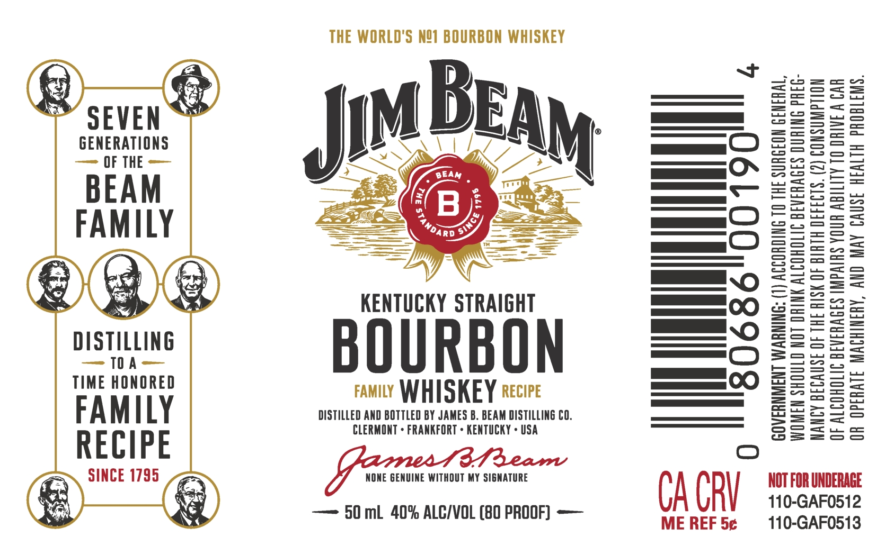

# TTB COLA Label Images - TTBID 26131001000751

**Brand Name:** JIM BEAM

**Issue Date:** 05/15/2026

**Origin Code:** 44

**Product Class/Type:** 101

**Source:** [TTB Public COLA Registry](https://ttbonline.gov/colasonline/viewColaDetails.do?action=publicFormDisplay&ttbid=26131001000751)

## Label Images

### Label 1

## Extracted Label Text

*Text extracted via OCR - may contain errors*

**Detected Proof:** 80

### Label 1

GENERATIONS
— OF THE

BEAM
FAMILY

DISTILLING
<= 10 A—
TIME HONORED

FAMILY
RECIPE

SINCE 1795 =

THE WORLD'S N21 BOURBON WHISKEY

KENTUCKY STRAIGHT

BOURBON

FAMILY WHISKEY 2ecire

DISTILLED AND BOTTLED BY JAMES B. BEAM DISTILLING CO.
CLERMONT » FRANKFORT + KENTUCKY + USA

y, NONE GENUINE WITHOUT MY SIGNATURE

— 50 mb 40% ALC/VOL (80 PROOF) —

80686

GOVERNMENT WARNING: (1) ACCORDING TO THE SURGEON GENERAL,

| HW 4,

0

CA CRY

ME REF 5¢

WOMEN SHOULD NOT ORINK ALCOHOLIC BEVERAGES DURING PREG-
NANCY BECAUSE OF THE RISK OF BIRTH DEFECTS. (2) CONSUMPTION
OF ALCOHOLIC BEVERAGES IMPAIRS YOUR ABILITY TO DRIVE A CAR
OR OPERATE MACHINERY, AND MAY CAUSE HEALTH PROBLEMS.

NOT FOR UNDERAGE
110-GAF0512
110-GAF0513
