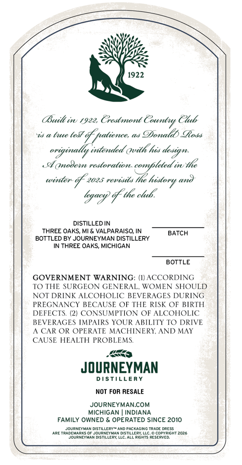
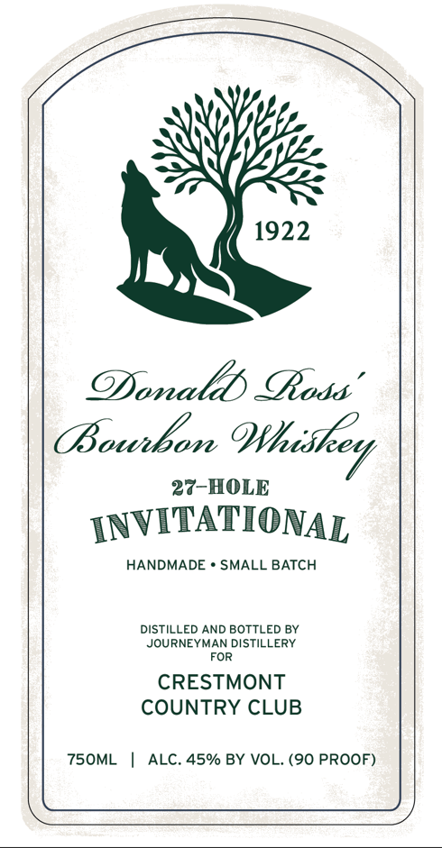

# TTB COLA Label Images - TTBID 26131001000764

**Brand Name:** DONALD ROSS'

**Issue Date:** 05/18/2026

**Origin Code:** 06

**Product Class/Type:** 141

**Source:** [TTB Public COLA Registry](https://ttbonline.gov/colasonline/viewColaDetails.do?action=publicFormDisplay&ttbid=26131001000764)

## Label Images

### Back Label

### Front Label

## Extracted Label Text

*Text extracted via OCR - may contain errors*

**Detected Proof:** 90

### Back Label

1922
(Built i 1922, Crestmond
Chbs
a (e (e5t _
df natiences
ODonalds SRochs
originally intended Qvith his design.
cl  nodeen restoration completed i the
winen
2025 rerasits
Ihe
(n0
lgacs % te ckub:
DISTILLED IN
THREE OAKS, MI & VALPARAISO, IN
BATCH
BOTTLED BY JOURNEYMAN DISTILLERY
IN THREE OAKS; MICHIGAN
BOTTLE
GOVERNMENT WARNING: (I)ACCORDING
T0 THE SURGEON GENERAL
WOMEN SHOULD
NOT DRINK ALCOHOLIC
BEVERAGES DURING
PREGNANCY BECAUSE OF THE RISK OF BIRTH
DEFECTS, (21 CONSUMPTION OF ALCOHOLIC
BEVERAGES IMPAIRS YOUR ABILITY T0 DRIVE
A CAR OR OPERATE MACHINERY AND MAY
CAUSE HEALTH PROBLEMS.
JOURNEYMAN
DISTILLERY
NOT FOR RESALE
JOURNEYMANCOM
MICHIGAN
INDIANA
FAMILY OWNED
OPERATED SINCE 2010
JcuDyeydAnm 5TILLEPTTAhD PacracikcTaAdE dPESS
LRE TRLDEHARRS
JourNEYUAN DISTILLERY
copyrGht 2026
JourNeMANdisMLLFATLLCALLRiGHTS Reserved
Countt
hisstory

### Front Label

1922
ODonalds cRoda'
OBowbon
hiskey
27-HOLE
INVITATIONAL
HANDMADE
SMALL BATCH
DISTiLLED AND BOTTLED BY
JOURNEYMAN DISTILLERY
FOR
CRESTMONT
COUNTRY CLUB
750ML
ALC. 45% BY VOL. (90 PROOF)
