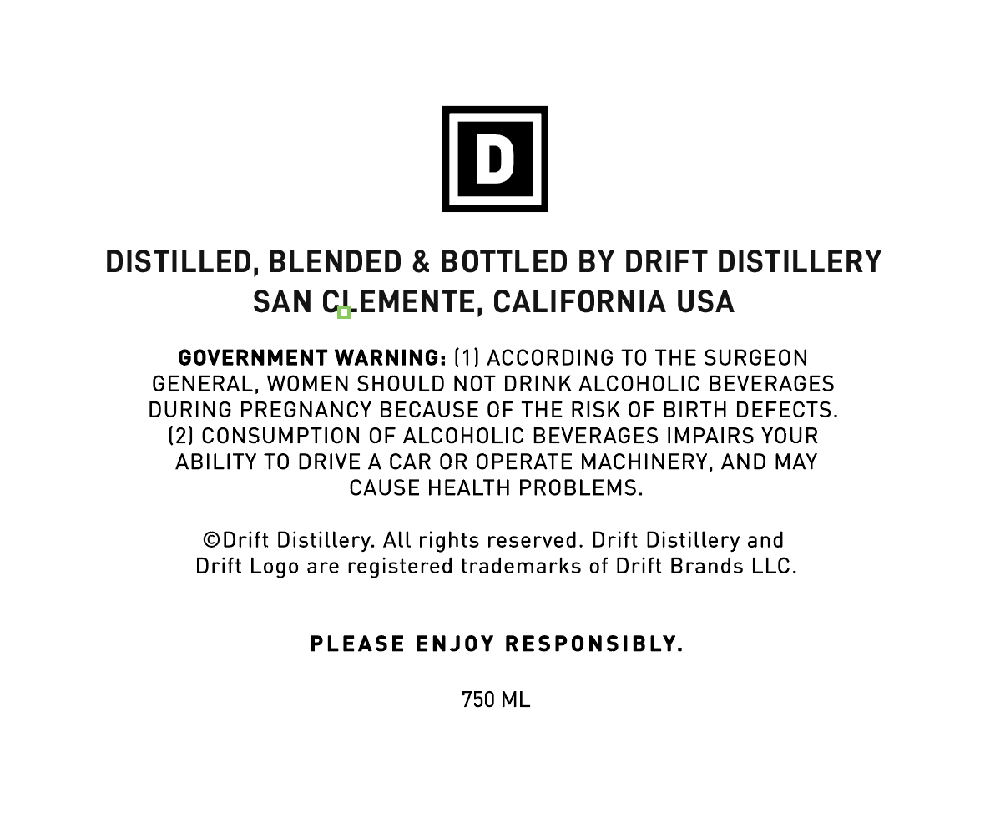
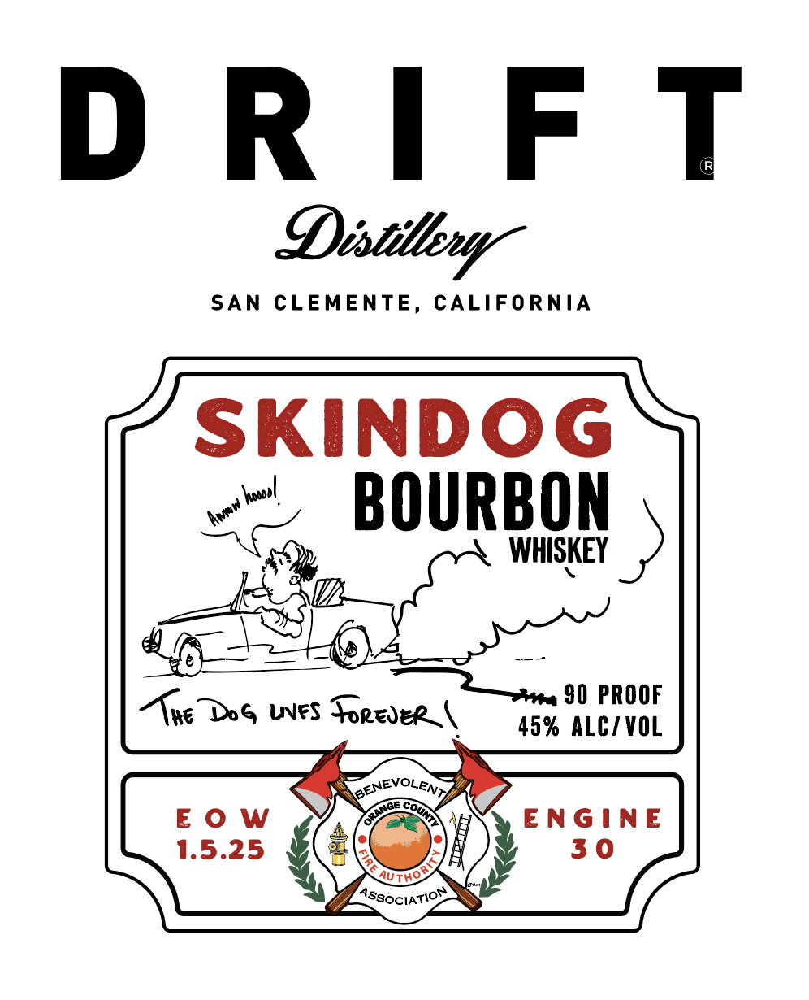

# TTB COLA Label Images - TTBID 26131001000816

**Brand Name:** SKINDOG BOURBON

**Issue Date:** 05/26/2026

**Origin Code:** 01

**Product Class/Type:** 141

**Source:** [TTB Public COLA Registry](https://ttbonline.gov/colasonline/viewColaDetails.do?action=publicFormDisplay&ttbid=26131001000816)

## Label Images

### Back Label

### Front Label

## Extracted Label Text

*Text extracted via OCR - may contain errors*

**Detected Proof:** 90

### Back Label

DISTILLED, BLENDED & BOTTLED BY DRIFT DISTILLERY

SAN CILEMENTE, CALIFORNIA USA

GOVERNMENT WARNING: (1) ACCORDING TO THE SURGEON

GENERAL, WOMEN SHOULD NOT DRINK ALCOHOLIC BEVERAGES

DURING PREGNANCY BECAUSE OF THE RISK OF BIRTH DEFECTS.

(2) CONSUMPTION OF ALCOHOLIC BEVERAGES IMPAIRS YOUR

ABILITY TO DRIVE A CAR OR OPERATE MACHINERY, AND MAY

CAUSE HEALTH PROBLEMS.

©Drift Distillery. All rights reserved. Drift Distillery and

Drift Logo are registered trademarks of Drift Brands LLC.

PLEASE ENJOY RESPONSIBLY.

750 ML

### Front Label

D R  F T
Distitbur"
SAN
CLEMENTE,
CALIFORNIA
SKindog
BOURBON
WHISKEY
90 PROOF
DG
UVFs
#rejer_
45% ALC/ VOL
BENEVOLENT
E 0 W
EnGinE
1.5.25
3 0
AUtHO
(AssOCIATIOR
kel
Ane
TNcd
Coun
