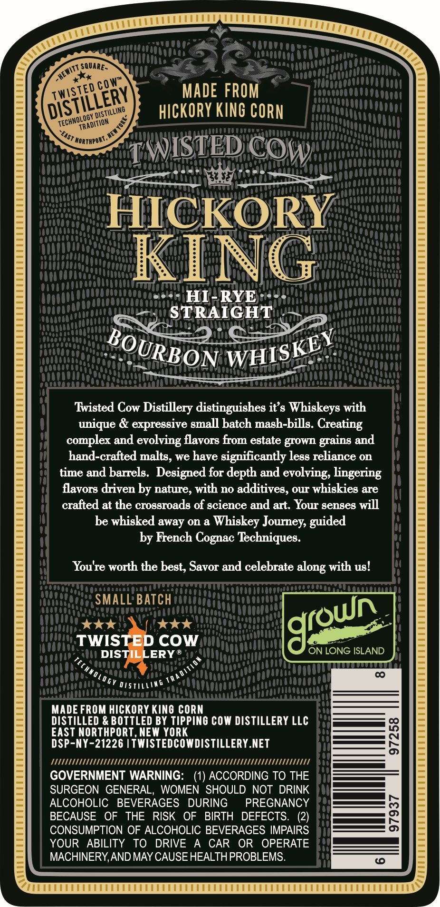
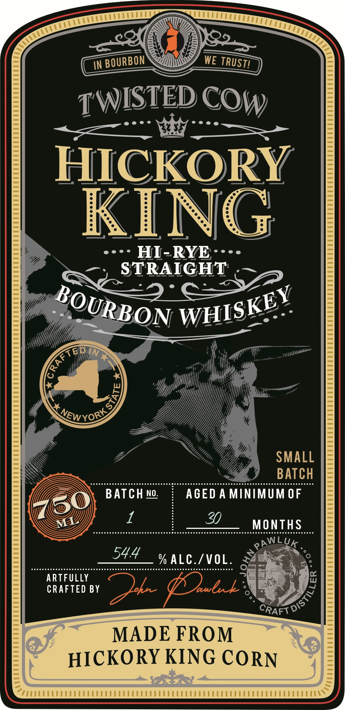

# TTB COLA Label Images - TTBID 26131001000909

**Brand Name:** HICKORY KING HI-RYE STRAIGHT BOURBON WHISKEY

**Issue Date:** 05/15/2026

**Origin Code:** 02

**Product Class/Type:** 101

**Source:** [TTB Public COLA Registry](https://ttbonline.gov/colasonline/viewColaDetails.do?action=publicFormDisplay&ttbid=26131001000909)

## Label Images

### Back Label

### Front Label

## Extracted Label Text

*Text extracted via OCR - may contain errors*

### Back Label

SQuAre -
MADE FROM
hIckORY KING CORN
'NorthPort
WISTED CO
HICKORY
KING
HI-
RYE
STRAIGHT
Twisted Cow Distillery distinguishes it s Whiskeys with
unique & expressive small batch mash-bills. Creating
complex and evolving flavors from estate grown
and
hand-crafted malts, we have significantly less reliance on
time and barrels:  Designed for depth and evolving, lingering
flavors driven by nature, with no additives, our whiskies are
crafted at the crogsroads of gcience and art. Your genses will
be whisked away on a Whiskey Journey, guided
by French Cognac Techniques.
Youre worth the best, Savor and celebrate
with us!
SMALL BATCH
TWISTED COW
DISTILLERY R
ON LONG ISLAND
6 TR
TIM
01oo
000
MADE FROM HICKORY KInO CORN
DISTILLED & BOTTLED BY TIPPINO COW DISTILLERY LLC
EAST NORTHPORT, NEW YORK
8
DSP-NY-21226 [TWISTEDCOWDISTILLERY.NET
M
II
GOVERNMENT WARNING:
ACCORDING TO THE
SURGEON GENERAL,
WOMEN  SHOULD NOT DRINK
ALCOHOLIC
BEVERAGES
DURING
PREGNANCY
BECAUSE
OF
THE
RISK
OF
BIRTH
DEFECTS.
(2)
8
CONSUMPTION OF ALCOHOLIC BEVERAGES IMPAIRS
YOUR
ABILITY
TO
DRIVE
CAR
OR
OPERATE
MACHINERY,AND MAY CAUSE HEALTHPROBLEMS.
~HEWITT =
cow"
TwistEd
DISTILLERY
'DISTILLING
~TECHMOLOGY
1
TRADITION
~EAST >
BOURBON
WHISKEY
gains
along
groun
:
0T5

### Front Label

TWISTED C Ow

HICKORY
K AN G

pt

oe _ Hl RYE----

wit

ARTFULLY
CRAFTED BY

MADE FROM
HICKORY KING CORN

=
7

TPMT TTT EEE E EEE E EEE EEE

Sy /

CTTTETETEN ENE LENE NE NEN EN EME NEUE NEUEN ERE RENE NEN ENE N ENE N EWEN EN ENE RENE RENE RENE RENE RENE NEUEN ENE RENE NEN ENE NEUEN EN ENE NEN EN EN ENE NENENENENENENERENERES®

a

s
