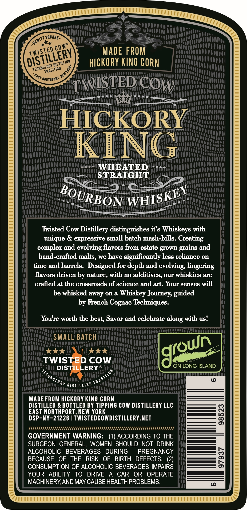
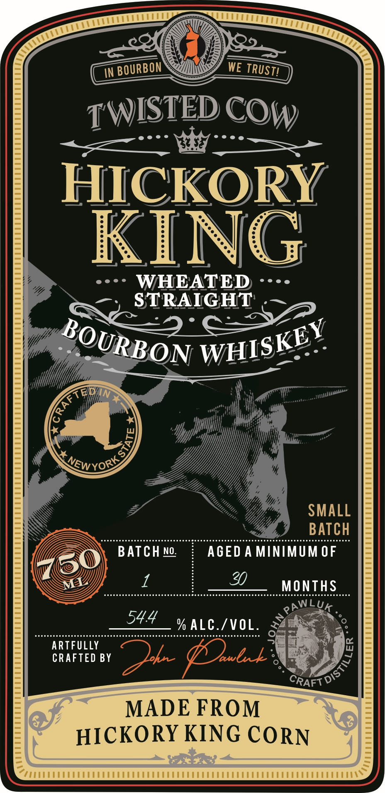

# TTB COLA Label Images - TTBID 26131001000918

**Brand Name:** HICKORY KING WHEATED STRAIGHT BOURBON WHISKEY

**Issue Date:** 05/15/2026

**Origin Code:** 02

**Product Class/Type:** 101

**Source:** [TTB Public COLA Registry](https://ttbonline.gov/colasonline/viewColaDetails.do?action=publicFormDisplay&ttbid=26131001000918)

## Label Images

### Back Label

### Front Label

## Extracted Label Text

*Text extracted via OCR - may contain errors*

### Back Label

Safe

Aart SOARES

4K

Eee 2

KP

‘<

1a)

wist

N

MADE FROM

all

gy HS!

TILING,

HICKORY KING CORN

ecw

SaaS

RADITION &

TWISTED COWy

HICKORY

KING

+t)| WHEAT ED +++

Lat

rating

a

OuRE 6 ON wise: ;

Twisted Cow Distillery distinguishes it’s Whiskeys with

unique & expressive small batch mash-bills. Creating

complex and evolving flavors from estate grown grains and

hand-crafted malts, we have significantly less reliance on

time and barrels. Designed for depth and evolving, lingering

flavors driven by nature, with no additives, our whiskies are

crafted at the crossroads of science and art. Your senses will

be whisked away on a Whiskey Journey, guided

by French Cognac Techniques

You're worth the best, Savor and celebrate along with us!

SMALL’ BATCH

kak

tk

TWIS

coWw

ON LONG ISLAND

%,

DIS’

ERY®

i)

a)

a

Per ays Ns

MADE FROM HICKORY KING CORN

DISTILLED & BOTTLED BY TIPPING COW DISTILLERY LLC

EAST NORTHPORT, NE

ee

DSP-NY-21226 | TWISTEDCOWDISTILLERY.NET

TTT

GOVERNMENT WARNING

(1) ACCORDING TO THE

SURGEON GENERAL, WOMEN SHOULD NOT DRINK

ALCOHOLIC BEVERAGES DURING

PREGNANCY

as

_————_F)

BECAUSE OF THE RISK OF BIRTH DEFECTS. (2)

CONSUMPTION OF ALCOHOLIC BEVERAGES IMPAIRS

es

YOUR ABILITY TO DRIVE A CAR OR OPERATE

MACHINERY, AND MAY CAUSE HEALTH PROBLEMS

### Front Label

HICKORY
KING

——F

---+ WHEATED ----
STRA

: oy
s Lew yorZ

ARTFULLY
CRAFTED BY =
Za /
MADE FROM
HICKORY KING CORN

=
7

TPMT TTT EEE E EEE E EEE EEE

s

Sy /

CTTTETETEN ENE LENE NE NEN EN EME NEUE NEUEN ERE RENE NEN ENE N ENE N EWEN EN ENE RENE RENE RENE RENE RENE NEUEN ENE RENE NEN ENE NEUEN EN ENE NEN EN EN ENE NENENENENENENERENERES®

a
