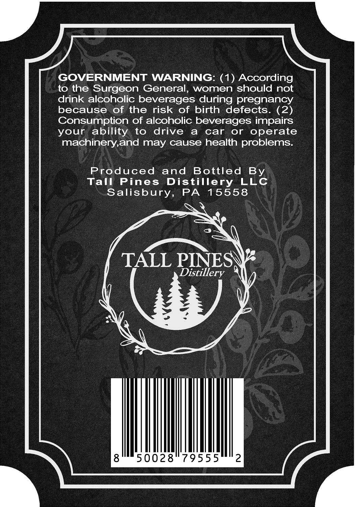
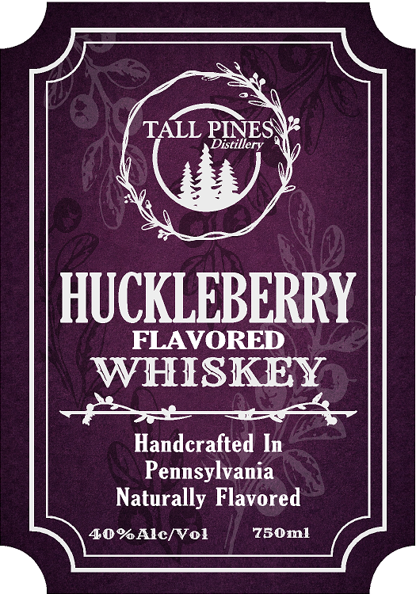

# TTB COLA Label Images - TTBID 26132001000078

**Brand Name:** TALL PINES DISTILLERY

**Issue Date:** 05/20/2026

**Origin Code:** 39

**Product Class/Type:** 149

**Source:** [TTB Public COLA Registry](https://ttbonline.gov/colasonline/viewColaDetails.do?action=publicFormDisplay&ttbid=26132001000078)

## Label Images

### Back Label

### Label 1

## Extracted Label Text

*Text extracted via OCR - may contain errors*

**Detected Proof:** 80

### Back Label

GOVERNMENT WARNING: (1) According
to the Surgeon General,
women should not
drink alcoholic beverages during pregnancy
because
of the
risk of birth
defects
(2)
Consumption of alcoholic beverages impairs
your ability
to
drive
a
car
or
operate
machinery,and may cause health problems:
Produced
and
Bottled
Tall
Pines
Distillery
LLc
Salisbury,
PA
15558
TALL PINES
Distillery
50028
79555
2
By

### Label 1

TALL
PINESE
HUCKLEBERRY
FLAVORED
WHISKEY
Handcrafted In
Pennsylvania
Naturally Flavored
40%Alc[Vol
750m]
