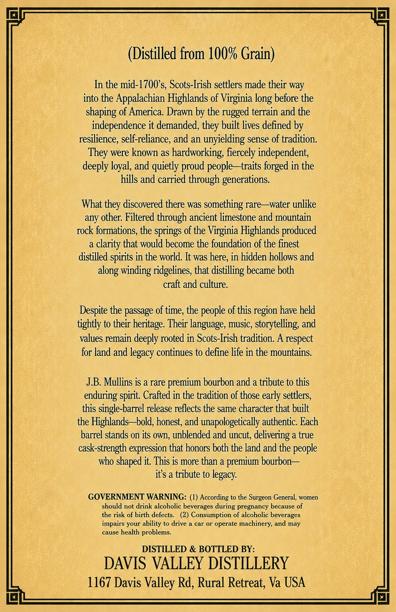
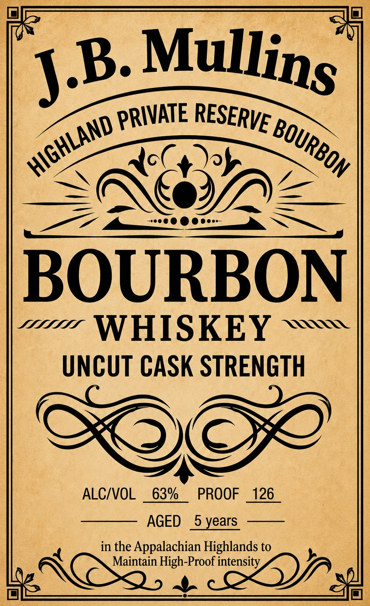

# TTB COLA Label Images - TTBID 26132001000079

**Brand Name:** J.B. MULLINS

**Issue Date:** 06/09/2026

**Origin Code:** 05

**Product Class/Type:** 141

**Source:** [TTB Public COLA Registry](https://ttbonline.gov/colasonline/viewColaDetails.do?action=publicFormDisplay&ttbid=26132001000079)

## Label Images

### Back Label

### Front Label

## Extracted Label Text

*Text extracted via OCR - may contain errors*

**Detected Proof:** 126
**Detected Age:** 5 Years

### Back Label

(Distilled from 100% Grain)
In the mid-1700s, Scots-Irish settlers made their way
into the Appalachian Highlands of Virginia
before the
shaping of America: Drawn by the rugged terrain and the
independence it demanded,
built lives defined by
resilience, self-reliance, and an unyielding sense of tradition:
were known as
hardworking; fiercely independent;
deeply loyal, and quietly proud people -traits forged in the
hills and carried through generations:
What
discovered there was something rare
~water unlike
any other: Filtered through ancient limestone and mountain
rock formations;, the springs of the Virginia Highlands produced
clarity that would become the foundation of the finest
distilled spirits in the world. It was here; in hidden hollows and
along winding ridgelines; that distilling became both
craft and culture
Despite the passage of time, the people of this region have held
tightly to their heritage Their language, music, storytelling, and
values remain deeply rooted in Scots-Irish tradition. A respect
for land and legacy continues to define life in the mountains:
JB. Mullins is a rare premium bourbon and a tribute to this
enduring spirit. Crafted in the tradition of those early settlers,
this single-barrel release reflects the same character that built
the Highlands-bold, honest, and unapologetically authentic: Each
barrel stands on its own, unblended and uncut; delivering a true
cask-strength expression that honors both the land and the people
who shaped it This is more than a premium bourbon
its a tribute to legacy:
GOVERNMENT WARNING: (1) According to the Surgeon General, women
should not drink alcoholic beverages during pregnancy because of
the risk of birth defects__
(2) Consumption of alcoholic beverages
impairs your ability to drive
car or operate machinery; and may
cause
health problems.
DISTILLED & BOTTLED BY:
DAVIS VALLEY DISTILLERY
1167 Davis Valley Rd, Rural Retreat; Va USA
long '
they.
They -
they

### Front Label

BOURBON
WHISKEY
UNCUT CASK STRENGTH
ALC/VOL
63%
PROOF
126
AGED
5 years
in the Appalachian Highlands to
Maintain High-Proof intensity_
Mullins
J.B
PRIVATE
RESERVE
HIGHLAND
BOURBON `
