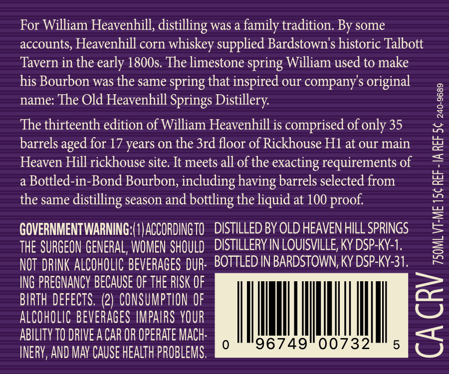
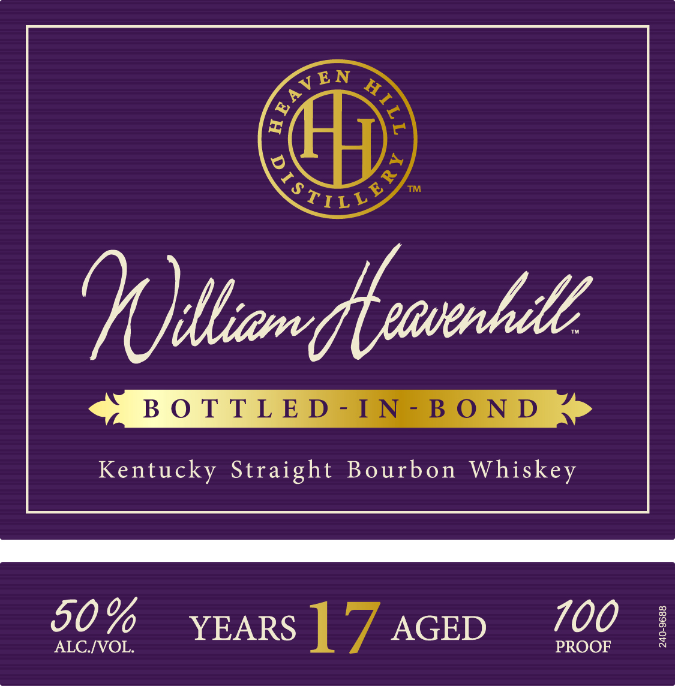

# TTB COLA Label Images - TTBID 26132001000117

**Brand Name:** WILLIAM HEAVENHILL

**Fanciful Name:** BOTTLED-IN-BOND 13TH EDITION

**Issue Date:** 05/21/2026

**Origin Code:** 22

**Product Class/Type:** 111

**Source:** [TTB Public COLA Registry](https://ttbonline.gov/colasonline/viewColaDetails.do?action=publicFormDisplay&ttbid=26132001000117)

## Label Images

### Back Label

### Label 1

## Extracted Label Text

*Text extracted via OCR - may contain errors*

**Detected Proof:** 100
**Detected Age:** 17 Years

### Back Label

For William Heavenhill, distilling was a family tradition. By some

accounts, Heavenhill corn whiskey supplied Bardstown’s historic Talbott

Tavern in the early 1800s. The limestone spring William used to make

his Bourbon was the same spring that inspired our company’s original

name: The Old Heavenhill Springs Distillery.

The thirteenth edition of William Heavenhill is comprised of only 35

barrels aged for 17 years on the 3rd floor of Rickhouse H1 at our main

Heaven Hill rickhouse site. It meets all of the exacting requirements of

a Bottled-in-Bond Bourbon, including having barrels selected from

the same distilling season and bottling the liquid at 100 proof.

GOVERNMENTWARNING:( 1) ACCORDING 10

DISTILLED BY OLD HEAVEN HILL SPRINGS

DISTILLERY IN LOUISVILLE, KY DSP-KY-1.

THE SURGEON GENERAL, WOMEN SHOULD

- BOTTLED IN BARDSTOWN, KY DSP-KY-31.

NOT DRINK ALCOHOLIC BEVERAGES DUR

ING PREGNANCY BECAUSE OF THE RISK OF

BIRTH DEFECTS. (2) CONSUMPTION OF

ALCOHOLIC BEVERAGES IMPAIRS YOUR

ABILITY TO DRIVE ACAR OR OPERATE MACH

|

|

|

(e)

96749" 00732

INERY, AND MAY CAUSE HEALTH PROBLEMS

### Label 1

~{ EN

™

Sr LLY

BOTTLED-IN-BOND

Kentucky Straight Bourbon Whiskey

700

50% YEA

ALC./VOL.

RS ] ‘7 AGED

PROOF
