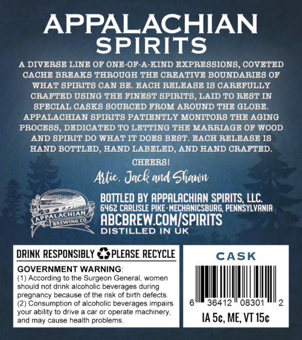
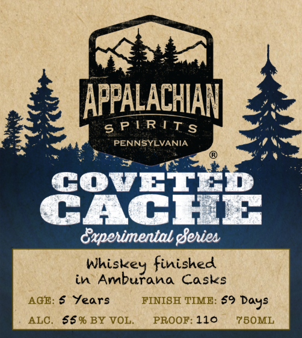

# TTB COLA Label Images - TTBID 26132001000125

**Brand Name:** APPALACHIAN SPIRITS

**Fanciful Name:** COVETED CACHE

**Issue Date:** 05/18/2026

**Origin Code:** 39

**Product Class/Type:** 140

**Source:** [TTB Public COLA Registry](https://ttbonline.gov/colasonline/viewColaDetails.do?action=publicFormDisplay&ttbid=26132001000125)

## Label Images

### Back Label

### Front Label

## Extracted Label Text

*Text extracted via OCR - may contain errors*

**Detected Proof:** 110
**Detected Age:** 6 Years

### Back Label

APPALACHIAN
SPIRITS
A DIVERBE LINE OF ONE-OF-A-KIND EXPREBBION8, COVETED
CACHE BREAK8 THROUGH THE CREATIVE BOUNDARIEB OP
WHAT BPTRIT8 CAN BE-
BACH RELEABE I8 CAREFULLY
CRAFTED UBING THE FINEBT BPIRIT8
LAID TO REBT IN
SPECIAL CASKS SOURCED FROM AROUND THE GLOBE_
APPALACHIAN BPIRITS PATIENTLY MONITORS THE AGING
PROCE8B, DEDICATED TO LETTING THE MARRIAGE OF WOOD
AND BPIRIT DO WHAT IT DOE8 BEBT. EACH RELEABE I8
HAND BOTTLED, HAND LABELED, AND HAND CRAFTED
CHEERBI
Astie , Jack and Slqwn
BOTTLED BY APPALACHIAN SPIRITS, LLC
6462 CARLISLE PIKE : MECHANICSBURG; PENNSYLVANIA
ABCBREW COMISPIRITS
DISTILLED IN UK
DRINK RESPONSIBLY
PLEASE RECYCLE
CASK
GOVERNMENT WARNING
(1) According to the Surgeon Genera
women
should not drink alcoholic beverages during
pregnancy because of the risk of birth defects
(2) Consumption cf alcoholic beverages impairs
36412
08301
your ability to drive
car
operate
machinery,
and may cause health problems;
IA 5c, ME, VT 15c
DALATHANN
AMWINO

### Front Label

APPALACHIAN

on

6s PERITs

is

PENNSYLVANIA

mn

v8

CcOoveET

CACHE

Oaperimental gferies

Whiskey finished

in Amburana Casks

AGE: 6 Years

FINISH TIME: $9 Days

ALC. $§% BY VOL.

PROOF: 110

75OML
