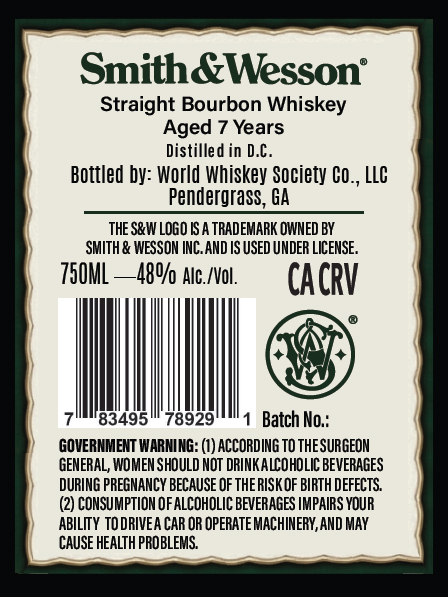
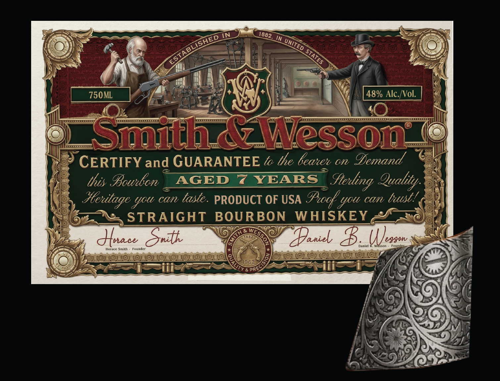

# TTB COLA Label Images - TTBID 26132001000269

**Brand Name:** SMITH & WESSON

**Issue Date:** 05/15/2026

**Origin Code:** 08

**Product Class/Type:** 101

**Source:** [TTB Public COLA Registry](https://ttbonline.gov/colasonline/viewColaDetails.do?action=publicFormDisplay&ttbid=26132001000269)

## Label Images

### Back Label

### Front Label

## Extracted Label Text

*Text extracted via OCR - may contain errors*

**Detected Proof:** 96
**Detected Age:** 7 Years

### Back Label

SmithaWesson"
Straight Bourbon Whiskey
Aged 7 Years
Distilled in D.C.
Bottled by: World Whiskey Society
LlC
Pendergrass, GA
THE SRW LOGO [S A TRADEMARK OWNED BY
SMITH & WESSOM INC_AND IS USED UNDER LICENSE _
750ML
48%/ Alc_ /Vol.
CACRV
183495
78929
Batch No:
GOVERNMENT WARNING: (0) ACCORDING TO THESURGEOM
GENERAL, WOMEN SHOULD NOT DRINKALCOHOLIC BEVERAGES
DURING PREGMANCY BECAUSE OF THE RISK OF BIRTH DEFECTS
(2) COMSUMPTLON OF ALCOHOLIC BEVERAGES IMPAIRS YOUR
ABILIY TO DRIVEA CAR OR OPERATE MACHINERY,AND MAY
CAUSE HEALTH PROBLEMS
Co,,

### Front Label

IN
IN
750ML
48% Alc /Vol:
Smith X Wesson
CERTIFY and GUARANTEE lo lhe beawee on Gemand
this Iowdbon
AGED
YEARS
Quality;
can taste. PRODUCT OF USA
@cocf you can bustt
STRAIGHT
BOURBON
WHISKEY
duaw
Snit
Haniel
U)ess
Daniel
WESSOm
Founoe
Horace
Smlth
Founder
8 PR
1882 ,
ESTABLISHED
UNITED
~STATES
Stenting
Hleuitage
Sol
