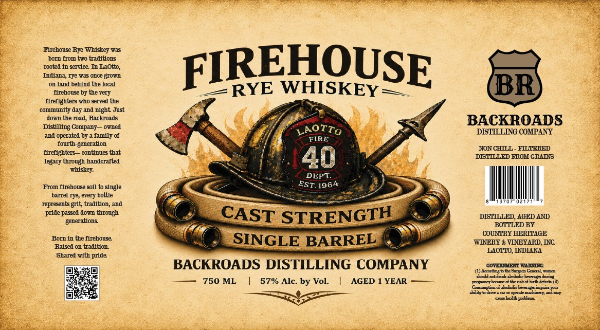

# TTB COLA Label Images - TTBID 26132001000304

**Brand Name:** BACKROADS DISTILLING COMPANY

**Fanciful Name:** FIREHOUSE RYE WHISKEY

**Issue Date:** 05/15/2026

**Origin Code:** 19

**Product Class/Type:** 142

**Source:** [TTB Public COLA Registry](https://ttbonline.gov/colasonline/viewColaDetails.do?action=publicFormDisplay&ttbid=26132001000304)

## Label Images

### Label 1

## Extracted Label Text

*Text extracted via OCR - may contain errors*

**Detected Proof:** 114

### Label 1

Elrehouse Rye Whiskey was
born from two traditlons
rooted In service In Laotto,
FIREHOUSE
Indlana rye was once grown
on land behlnd the local
WHISKEY
BR
flrehouse by the Fery
frefighters who served the
communlty day and nlght Just
dow the road, Backroads
BACKROADS
Distllling Company
owed
LAOTTO
DISTILLING COMPANY
ad
operated bJ
family of
FIRE
fourth-generatlon
freflghters
contlnues that
NON CHLLL
FILTERED
legacy through handcrafted
40
DETLLLED FROM GRAD
vhlskey:
DEPT:
From flrehouse soll to slngle
1964
barrel rye, every bottle
represents grit, tradltlon; and
prdde passed down through
STRENGTH
DISTLLED AGHD AND
generations
BOTTLED BY
COUNTRY HERITAGE
Born In the flrehouse
SINGLE BARREL
WINERY & VINEYARD, INC
Ralsed on traditlon
LAOTTO, IDIANA
Shared with pride
BACKROADS DISTILLING COMPANY
COYEEH W4hG:
(1) Axcalingb t Surgeo GanardL uaxa
turing
750 ML
57% Alc by Vol:
AGED
YEAR
Ecboli odinki eeoltd Eredrin 2)
Coamption d :koLokcbregsiZpiir
xili"
dn1eeonnkmihay;1121
Daba probkeae
RYE
EST.
CAST
