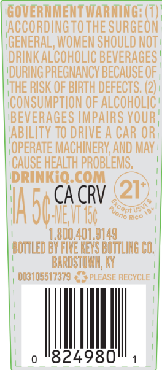
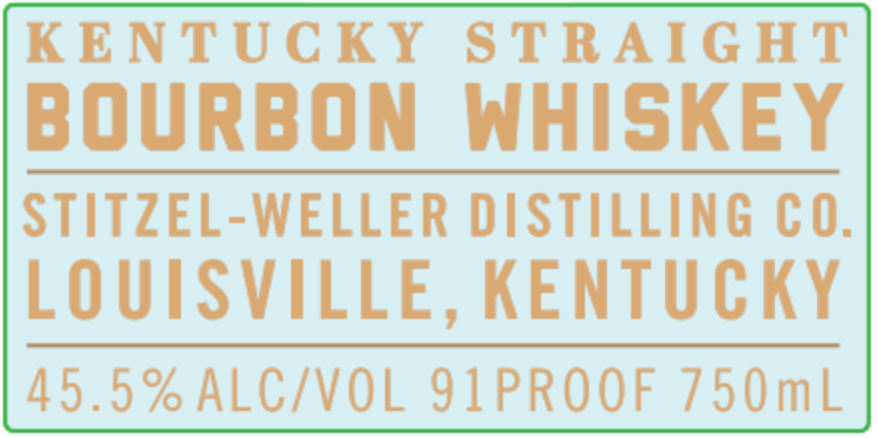
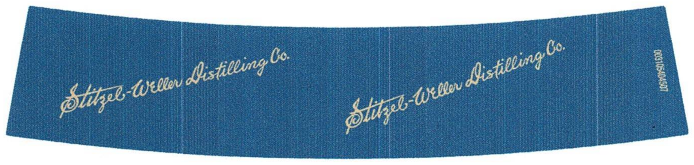
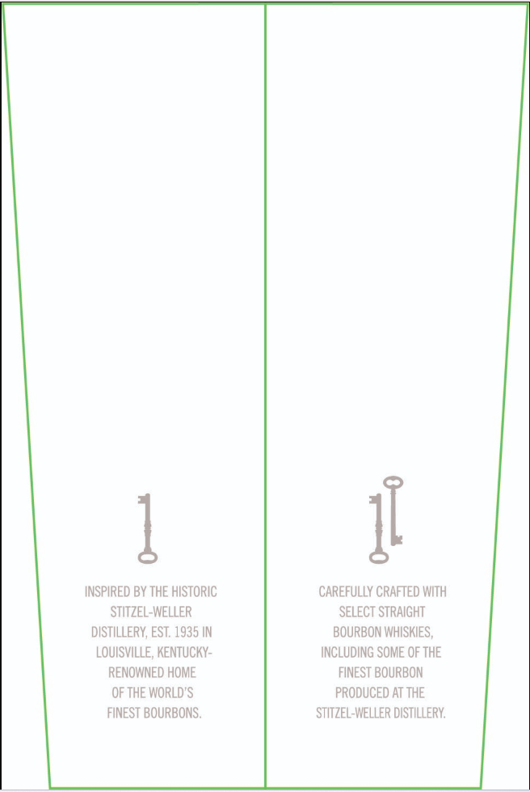
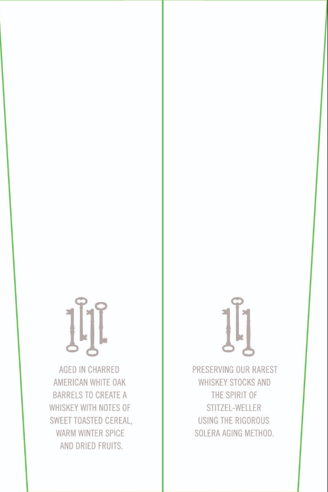
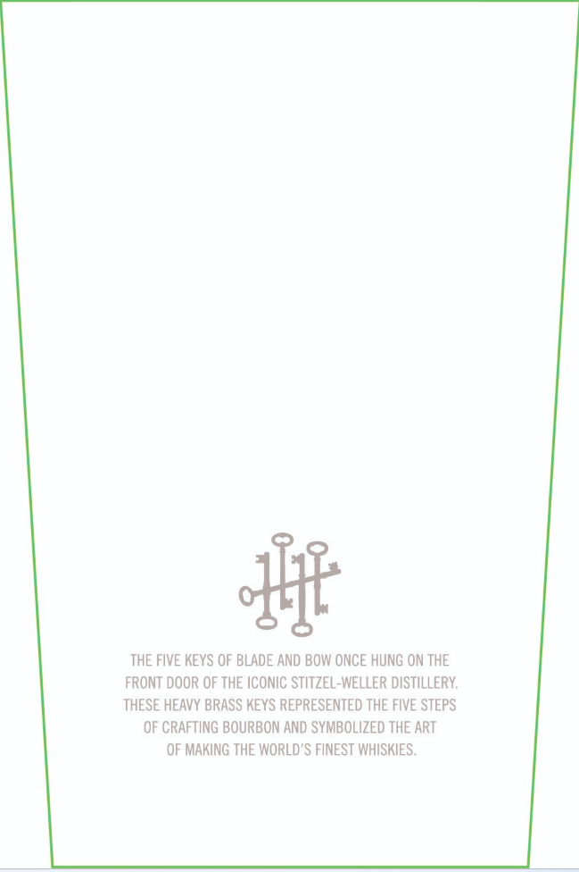

# TTB COLA Label Images - TTBID 26132001000517

**Brand Name:** BLADE AND BOW

**Issue Date:** 05/20/2026

**Origin Code:** 22

**Product Class/Type:** 101

**Source:** [TTB Public COLA Registry](https://ttbonline.gov/colasonline/viewColaDetails.do?action=publicFormDisplay&ttbid=26132001000517)

## Label Images

### Back Label

### Front Label

### Label 4

### Label 5

### Label 6

### Label 7

## Extracted Label Text

*Text extracted via OCR - may contain errors*

*1 image(s) excluded: text did not meet readability threshold*

**Detected Proof:** 91

### Back Label

GOVERTMETT WARMING; (T) "
VACCORDINGTOTHE SURGEON
GENERAL; WOMEN SHOULD NOT=
'DRINK ALCOHOLIC BEVERAGES E
DURING PREGNANCY BECAUSE OF
ITHE RISK OF BIRTH DEFECTS; (2)
'CONSUMPTION OF ALCohOLIC =
BEVERAGES IMPAIRS VOUR,
ABILITY TO DRIVE A CAR ORI
OPERATE MACHINERV; AND MAV _
ICAUSE HEALTH PROBLEMS;
DRINKIO coM
CA CRV
21*
HasgCacrv
"8Rico |
L.800.401.9149
BOTLED BYgWELEIS ROMLNG CO
BARDSTOHIL [
003105517379
PLEASE RECYCLE
824980'
'Orto

### Front Label

KENTUCKY
S TRAIG HT
BOURBON
WHISKEY
STITzEL-WELLER DISTILLING CO.
LOUISVILLE, KENTUCKY
45.5 % ALC/VOL 91PROOF 750mL

### Label 5

IL
INSPIRED BY THE HISTORIC
CAREFULLY CRAFTED WIth
STITZEL-WELLER
SELECT STRAIGHT
DISTILLERY; EST; 1935 IN
BOURBON WHISKIES ,
LOUISVILLe, KenTuCKY-
INCLUDING SOME OF THE
RENOWNED HOME
FINEST BOURBON
OF THE WORLD'S
PRODUCED AT THE
FINEST BOURBONS ,
STITZEL-WELLER DISTILLERY

### Label 6

int

AGED IN CHARRED PRESERVING OUR RAREST
AMERICAN WHITE OAK WHISKEY STOCKS AND
BARRELS TO CREATE A THE SPIRIT OF

WHISKEY WITH NOTES OF STITZEL-WELLER
SWEET TOASTED CEREAL, USING THE RIGOROUS
WARM WINTER SPICE SOLERA AGING METHOD.

AND DRIED FRUITS.

### Label 7

THE FIVE KEYS OF BLADE AND BOW ONCE HUNG ON THE
FRONT DOOR OF THE ICONIC STITZEL-WELLER DISTILLERY:
THESE HEAVY BRASS KEYS REPRESENTED THE FIVE STEPS
OF CRAFTING BOURBON AND SYMBOLIZED THE ART
OF MAKING THE WORLD'S FINEST WHISKIES .
