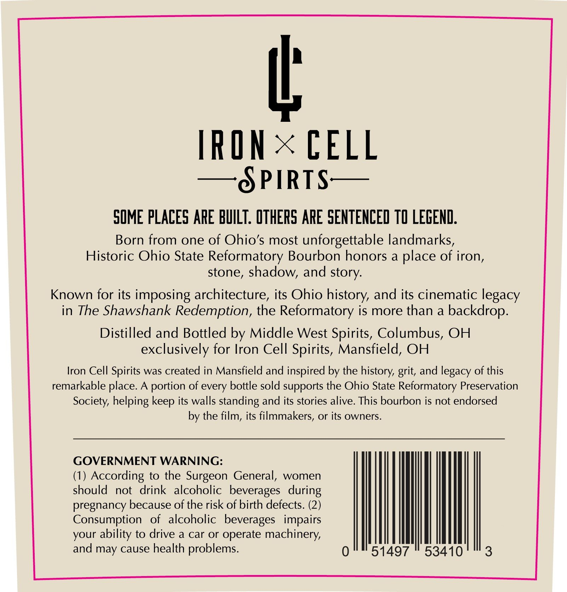
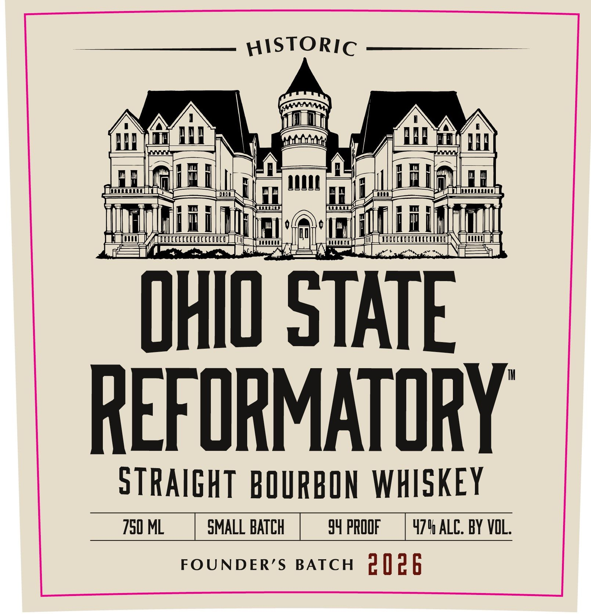

# TTB COLA Label Images - TTBID 26132001000599

**Brand Name:** HISTORIC OHIO STATE REFORMATORY

**Issue Date:** 05/15/2026

**Origin Code:** 09

**Product Class/Type:** 101

**Source:** [TTB Public COLA Registry](https://ttbonline.gov/colasonline/viewColaDetails.do?action=publicFormDisplay&ttbid=26132001000599)

## Label Images

### Back Label

### Front Label

## Extracted Label Text

*Text extracted via OCR - may contain errors*

**Detected Proof:** 108

### Back Label

IRON = CELL

—§ PIRTS—

SOME PLACES ARE BUILT. OTHERS ARE SENTENCED TO LEGEND.

Born from one of Ohio’s most unforgettable landmarks,
Historic Ohio State Reformatory Bourbon honors a place of iron,
stone, shadow, and story.

Known for its imposing architecture, its Ohio history, and its cinematic legacy

in The Shawshank Redemption, the Reformatory is more than a backdrop.

Distilled and Bottled by Middle West Spirits, Columbus, OH
exclusively for Iron Cell Spirits, Mansfield, OH

Iron Cell Spirits was created in Mansfield and inspired by the history, grit, and legacy of this

remarkable place. A portion of every bottle sold supports the Ohio State Reformatory Preservation

Society, helping keep its walls standing and its stories alive. This bourbon is not endorsed
by the film, its filmmakers, or its owners.

GOVERNMENT WARNING:
(1) According to the Surgeon General, women
should not drink alcoholic beverages during
pregnancy because of the risk of birth defects. (2)
Consumption of alcoholic beverages impairs
your ability to drive a car or operate machinery,
and may cause health problems.

WMT

### Front Label

HISTORIC

yy fam AE

(rrr

I

UT

hs)

‘lg

lnesonensee

fate

|

fen Li Tasttt0}

lili

Wu it

i

OHIO STATE

REFORMATORY

STRAIGHT BOURBON WHISKEY

750 ML

SMALL BATCH

54 PROOF | 474 ALC. BY VOL

FOUNDER’S BATCH PI] P§
