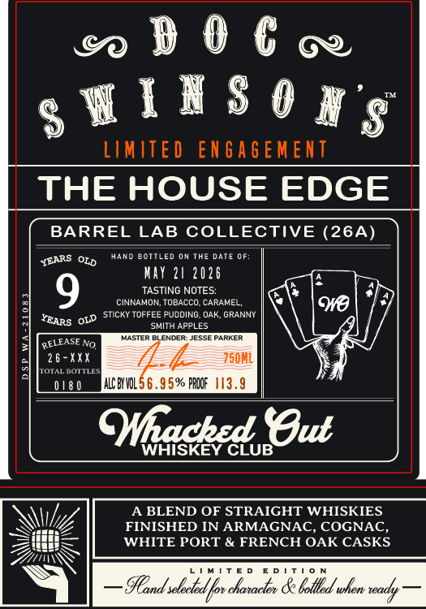
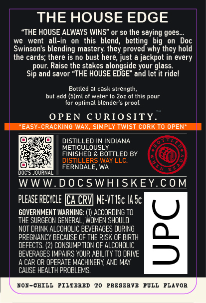

# TTB COLA Label Images - TTBID 26132001000757

**Brand Name:** DOC SWINSON'S

**Fanciful Name:** THE HOUSE EDGE

**Issue Date:** 05/21/2026

**Origin Code:** 07

**Product Class/Type:** 120

**Source:** [TTB Public COLA Registry](https://ttbonline.gov/colasonline/viewColaDetails.do?action=publicFormDisplay&ttbid=26132001000757)

## Label Images

### Label 1

### Label 2

## Extracted Label Text

*Text extracted via OCR - may contain errors*

### Label 1

DOERR

gWlhS Ons

LIMITED ENGAGEMENT

THE HOUSE EDGE

BARREL LAB COLLECTIVE (26A)

SEARS Ory

HAND BOTTLED ON THE DATE OF:

WAY 21 2026

TASTING NOTES:

CINNAMON, TOBACCO, CARAMEL,

=| ‘Bars

oud STICKY TOFFEE PUDDING, OAK, GRANNY

SMITH APPLES

MASTER BLENDER.

ESE PARKER

RELEASE No,

fh

26

ort

Xx

0180

ALC BIOL:

PROOF

hacked Gut

WHISKEY CLUB

A BLEND OF STRAIGHT WHISKIES

Pi

FINISHED IN ARMAGNAC, COGNAC,

WHITE PORT & FRENCH OAK CASKS.

Si

eZ

MITE

nel

sadly

### Label 2

THE HOUSE EDGE
"THE HOUSE ALWAYS WINS" or so the saying goes
we
went
all-in
this   blend, betting   big
Doc
Swinson $ blending mastery they proved why they hold
the cards; there is no bust here, just
jackpot in every
pour;
Raise the stakes alongside your glass
Sip and savor "THE HOUSE EDGE" and let it ridel
Bottled at cask strength;
but add (S)ml of water to Zoz of this pour
optimal blender 5 proof
0 PEN
CURIOSITY
EASY-CRACKING WAX;
SimpLY Twist cork To OPEN*
DISTILLED IN INDIANA
METICULOUSL
FINISHED & BOTTLED BY
DISTILLERS WAY LLC:
FERNDALE; WA
Wue
QURNAL
WWW
D OCSWHISKEY COM
PLEASE RECYCLE [A CRV] Me-VT I5c IA Sc
GOVERNMENT WARNING:
ACCORDING To
THE SURGEON GENERAL, WOMEN SHOULD
NOT DRINK ALCOHOLIC BEVERAGES DURING
PREGNANCY BECAUSE OF THE RISK OF EIRTH
DEFECTS: (2) CONSUMPTION OF ALCOHOLIC
BEVERAGES IMPAIRS YOUR ABILITY TO DRIVE
A CAR OR OPERATE MACHINERY; AND MAY
CAUSE HEALTH PROBLEMS
ROF-CHILL
PILTERED
PRESERVE
ZOLL PLAVOR
