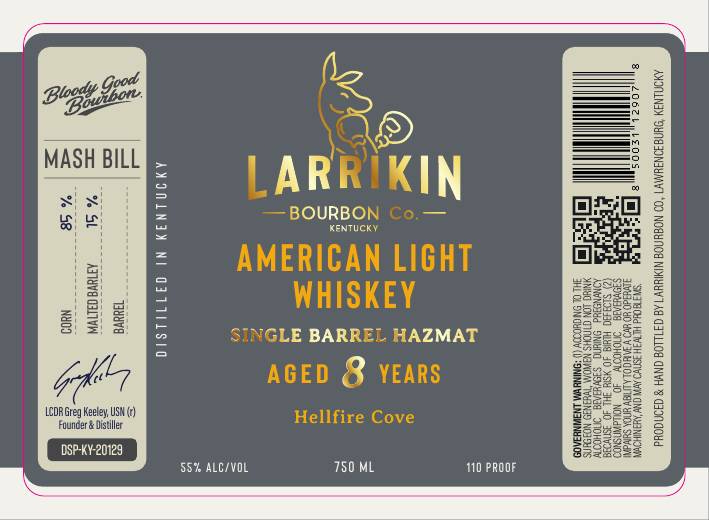
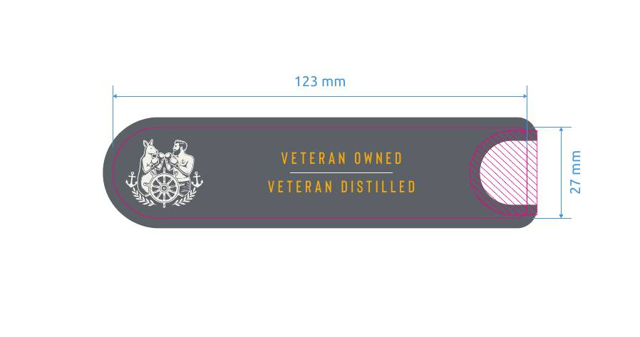

# TTB COLA Label Images - TTBID 26132001000819

**Brand Name:** LARRIKIN BOURBON CO.

**Fanciful Name:** AMERICAN LIGHT WHISKEY - HELLFIRE COVE

**Issue Date:** 05/15/2026

**Origin Code:** 22

**Product Class/Type:** 144

**Source:** [TTB Public COLA Registry](https://ttbonline.gov/colasonline/viewColaDetails.do?action=publicFormDisplay&ttbid=26132001000819)

## Label Images

### Label 1

### Label 2

## Extracted Label Text

*Text extracted via OCR - may contain errors*

*1 image(s) excluded: text did not meet readability threshold*

**Detected Age:** 8 Years

### Label 1

8
1
MASH BILL
LARRIKIN
1
BOURBONICo
8
KentuCK
AMERICAN LIGHT
1
WHISKEY
34
8
1
SINGLE BARREL HAZMAT
2
|
AGED 8 YEARS
J
LCDR Greg Keeley USM {)
Hellfire Cove
Fourcer & Distiller
SE
33323
DSP-KY-20129
8323333
557 ALCIVL
750 ML
I1 PPOOF
'iztugac
Blogty
