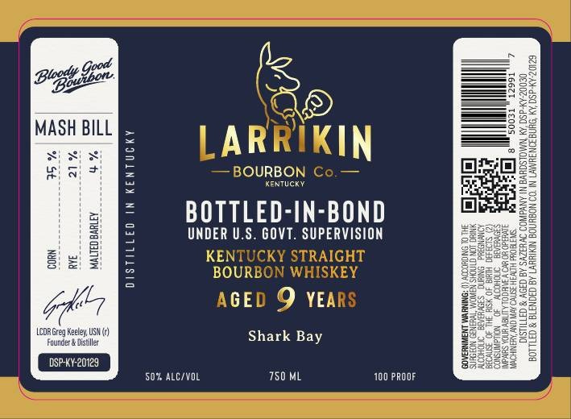

# TTB COLA Label Images - TTBID 26132001000828

**Brand Name:** LARRIKIN BOURBON CO.

**Fanciful Name:** BOTTLED IN BOND - SHARK BAY

**Issue Date:** 05/15/2026

**Origin Code:** 22

**Product Class/Type:** 111

**Source:** [TTB Public COLA Registry](https://ttbonline.gov/colasonline/viewColaDetails.do?action=publicFormDisplay&ttbid=26132001000828)

## Label Images

### Label 1

### Label 2

## Extracted Label Text

*Text extracted via OCR - may contain errors*

**Detected Proof:** 100
**Detected Age:** 9 Years

### Label 1

Bow
00
0
MASH BILL
{
5
LARRIKIN
]
#
BOURBON Co
KentuCK
BOTLEd-IMPBOSD
I
3 2
1
:
KENTUCKY STRAIGHT
1
2
BOURBON WHISKEY
62
AGED 9 YEARS
#
LCDR Greg Keeley USN {)
Shark
88
Fourcer & Distiller
Kat
DSP-KY-20129
50% ALCIVOL
750 ML
100 PROOF=
Gsoc |
Blosty
Bay

### Label 2

VETERAN OWNED

Leer y VETERAN DISTILLED
BE
