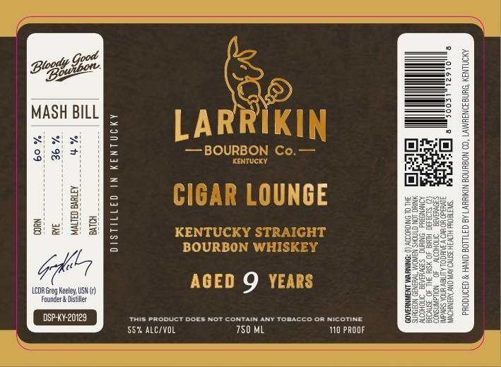
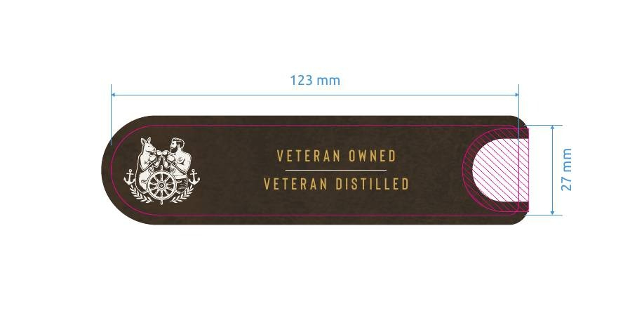

# TTB COLA Label Images - TTBID 26132001000835

**Brand Name:** LARRIKIN BOURBON CO.

**Fanciful Name:** CIGAR LOUNGE

**Issue Date:** 05/18/2026

**Origin Code:** 22

**Product Class/Type:** 101

**Source:** [TTB Public COLA Registry](https://ttbonline.gov/colasonline/viewColaDetails.do?action=publicFormDisplay&ttbid=26132001000835)

## Label Images

### Label 1

### Label 2

## Extracted Label Text

*Text extracted via OCR - may contain errors*

*1 image(s) excluded: text did not meet readability threshold*

**Detected Age:** 9 Years

### Label 1

3u8h9z4
3
1
MASH BILL
LARRIKIN
3
1
BOURBON Co.
CENTucKY
CIOAR LOUNCE
8 2
1
E
KENTUCKY STRAIGHT
[
BOURBON WHISKEY
ABED 9 YEARS
0
LCDR Greg Keeley USN {c)
Founcer & Jistiller
DSP-KY-20129
This product
DoES
CONTAIN ANT Tobacco Or Nicotine
M
553 ALCIVOL
750 ML
I10 PRODF
1
