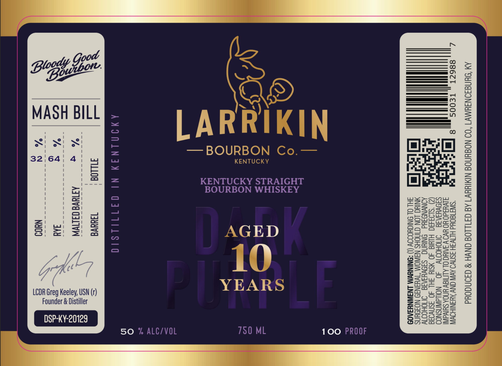

# TTB COLA Label Images - TTBID 26132001000838

**Brand Name:** LARRIKIN BOURBON CO.

**Fanciful Name:** DARK PURPLE

**Issue Date:** 05/26/2026

**Origin Code:** 22

**Product Class/Type:** 101

**Source:** [TTB Public COLA Registry](https://ttbonline.gov/colasonline/viewColaDetails.do?action=publicFormDisplay&ttbid=26132001000838)

## Label Images

### Label 1

### Label 2

## Extracted Label Text

*Text extracted via OCR - may contain errors*

**Detected Proof:** 100

### Label 1

MY SUNGSONIYMYT “OD NOBYNOE NIMIHYV1 AS GIILLOG GNVH 8 d40NdOud

Z,,, 886cT , TE00S ,. 8 [a] rr SWI 1GOUd HEWSH JSNV9 AVN ONY AWANIHOVN
4 AV4Id0 YO YVOV SAIN OL ALITIGY YNOA SUIVdINI

. SIOVYIAIG §=INOHOIIV 40 NOLdWNSNOD

K (Z) ‘S103490 HIdId 40 ¥SIY SHL 40 3SnVo3a

XONVNOSYd ONIUNG SIOVYIAI INOHODT
io NING LON GINOHS NSWOM ‘TWY¥INI9 NOFOYNS
JH OL SNIGHOOOY (1) “ONINYWM LNSWNYSA0D

a
YEAR{

BOURBON WHISKEY

KENTUCKY STRAIGHT

=_"

AMIMLNIY NI GII1I1S10

)

TILLOG 730d
ATTUVE CALIWN

(r

USN

Au
Nu0d

Founder & Distiller
DSP-KY-20129

MASH BILL

LCDR Greg Keeley,

780 ML 100 PROOF

50 % ALC/VOL

### Label 2

123 mm
 @
ae) VETERAN OWNED N Je
Lees SIE
ages VETERAN DISTILLED 5
