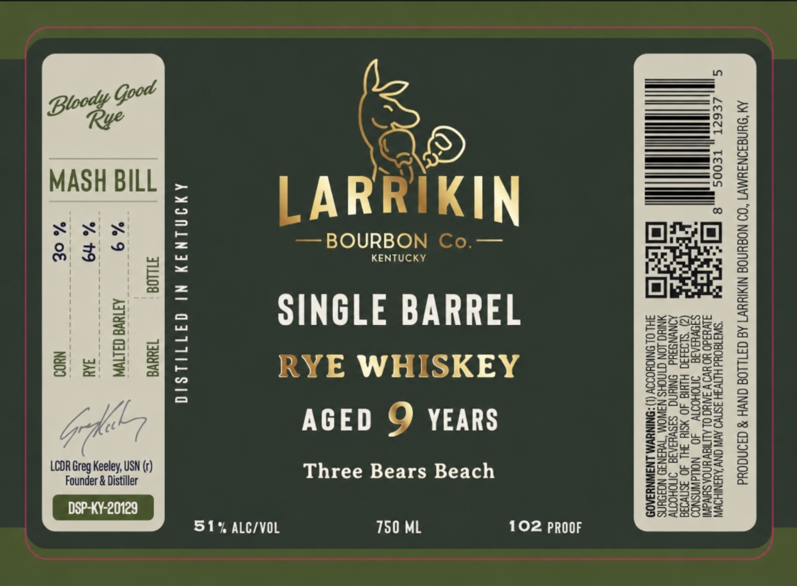
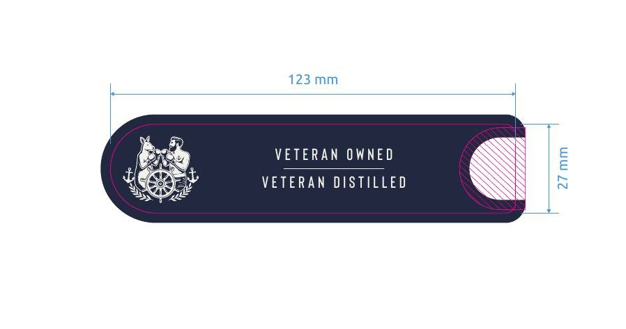

# TTB COLA Label Images - TTBID 26132001000840

**Brand Name:** LARRIKIN BOURBON CO.

**Fanciful Name:** RYE WHISKEY - THREE BEARS BEACH

**Issue Date:** 05/20/2026

**Origin Code:** 22

**Product Class/Type:** 142

**Source:** [TTB Public COLA Registry](https://ttbonline.gov/colasonline/viewColaDetails.do?action=publicFormDisplay&ttbid=26132001000840)

## Label Images

### Label 1

### Label 2

## Extracted Label Text

*Text extracted via OCR - may contain errors*

**Detected Proof:** 102

### Label 1

AM ‘SUNGIINIYMV1 “OD NOBYNOE NIMIWYVT Ad GF1LLO8 GNVH 8 GONGOud
8 io ‘ “SW3 180d HLTV3H ISNV9 AV ONY AUANIHOWW,
=

me

fl “ NIUG LON CINOHS N3WOM “Tv¥3N39 NOISYNS
3HL OL SNIGHOOOY (l) :SNINUWM LNAWNYIA09

IKIN

)
~~ BOURBON co
SINGLE BARREL
RYE WHISKEY
AGED Q YEARS
Three Bears Beach

LARR

AMIMLNIY NI QIT1ILSIO
TiLL08 T3uava

9 ATTNVE GALTVA

19 aA

% OF NuOo

Founder & Distiller

LCOR Greg Keeley, USN (r)

—_l
—
co
=
~”
<r
=

750 ML 102 PROOF

51% ALC/VOL

### Label 2

VETERAN OWNED

Leer y VETERAN DISTILLED
BE
