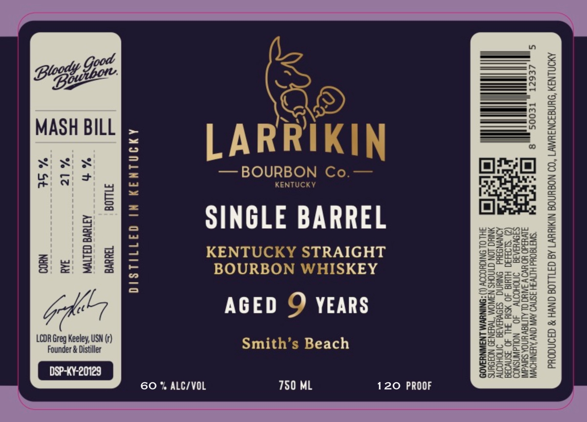
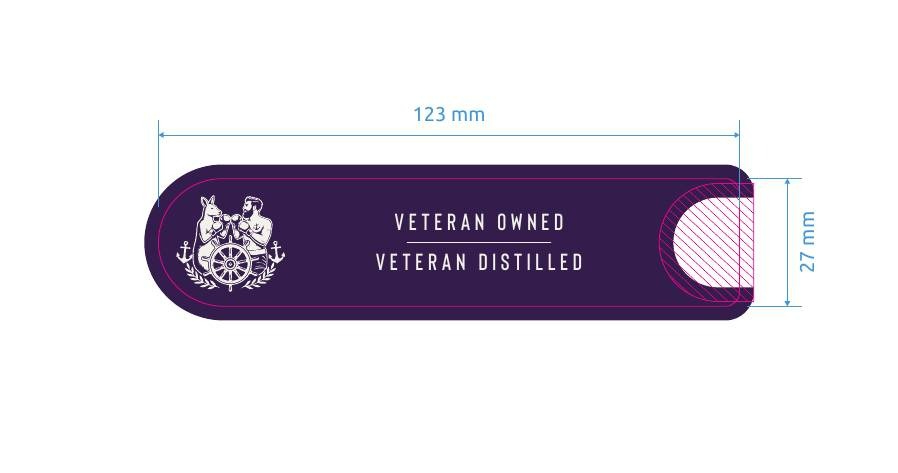

# TTB COLA Label Images - TTBID 26132001000850

**Brand Name:** LARRIKIN BOURBON CO.

**Fanciful Name:** SINGLE BARREL BOURBON - SMITH'S BEACH

**Issue Date:** 05/20/2026

**Origin Code:** 22

**Product Class/Type:** 101

**Source:** [TTB Public COLA Registry](https://ttbonline.gov/colasonline/viewColaDetails.do?action=publicFormDisplay&ttbid=26132001000850)

## Label Images

### Label 1

### Label 2

## Extracted Label Text

*Text extracted via OCR - may contain errors*

**Detected Proof:** 120

### Label 1

AMONLNSY ‘SYNGIONIYM7 “OD NOSYNOG NIMINYWT Ad GFTLLOG GNVH 8 d39NGOYd

Ay
=

SINGLE BARREL

— BOURBON

AMINLNAY

hh
% lt
% St

—
—
co
=e
wa
=<c
pT

AL |

Nl

TILLOG
ATINVE CILIA

SITS OUd HITVSH 3SNWO AYA ONY AYNIHOW
AUWHAd0 YO UV V IAC OL ALITISW YNOA Sli
SIOVHIAIG §=ONOHOIW 40 NOLIdWNSNOD
(2) “SLOB430 HIHIG 40 YSIY SHI 40 3SNvoad
SIOWUIAIG INOHOTIY

M TWHINI9 NOJOUNS

INUVM LNAWNYSA09

SING. ION nou
HL OL 9NIGHOOOY (

—KY STRAIGHT
/HISKEY
O YEARS
Smith’s Beach

KENTUC
BOURBON |
AGED

qji1ilsia
TUWVE

IN
NYOS

DSP-KY-20129

Founder & Distiller

Gone i
LCDR Greg Keeley, USN (r)

750 ML 120 PROOF

6O % ALC/VOL

### Label 2

123 mm
 @
ae) VETERAN OWNED N Je
Lees SIE
ages VETERAN DISTILLED 5
