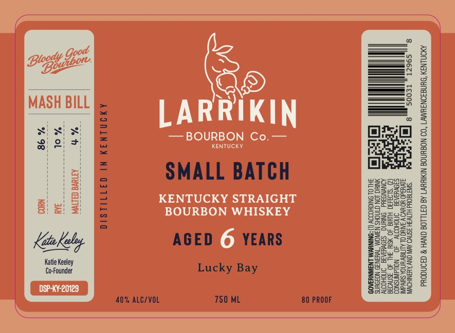
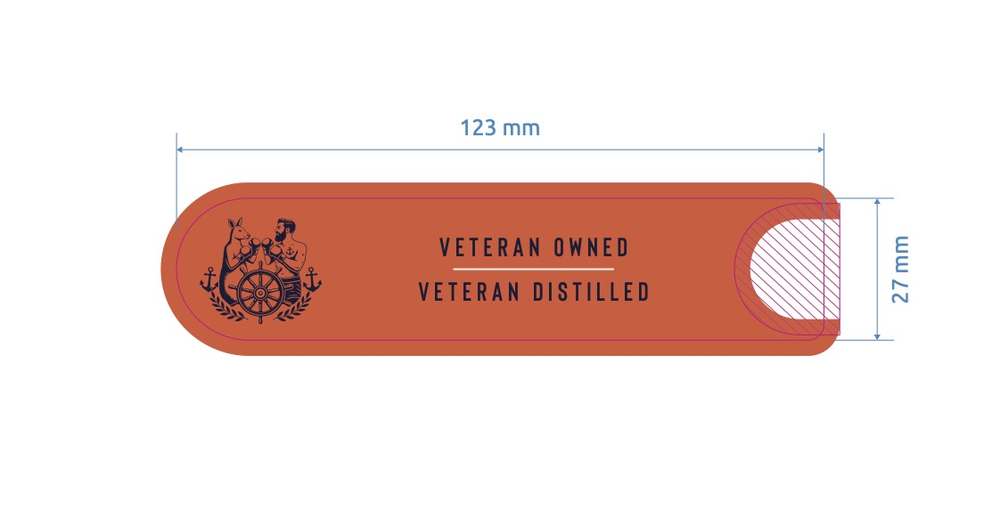

# TTB COLA Label Images - TTBID 26132001000852

**Brand Name:** LARRIKIN BOURBON CO.

**Fanciful Name:** SMALL BATCH - LUCKY BAY

**Issue Date:** 05/15/2026

**Origin Code:** 22

**Product Class/Type:** 101

**Source:** [TTB Public COLA Registry](https://ttbonline.gov/colasonline/viewColaDetails.do?action=publicFormDisplay&ttbid=26132001000852)

## Label Images

### Label 1

### Label 2

## Extracted Label Text

*Text extracted via OCR - may contain errors*

*1 image(s) excluded: text did not meet readability threshold*

**Detected Proof:** 80

### Label 1

You

SQ

_

———

MASH BILL

LARRIKIN

— BOURBON Co.—

KENTUCKY

SMALL BATCH

KENTUCKY STRAIGHT

s

z

=

we

BOURBON WHISKEY

AGED © YEARS

Lucky Bay

40% ALC/VOL

750 ML

80 PROOF
