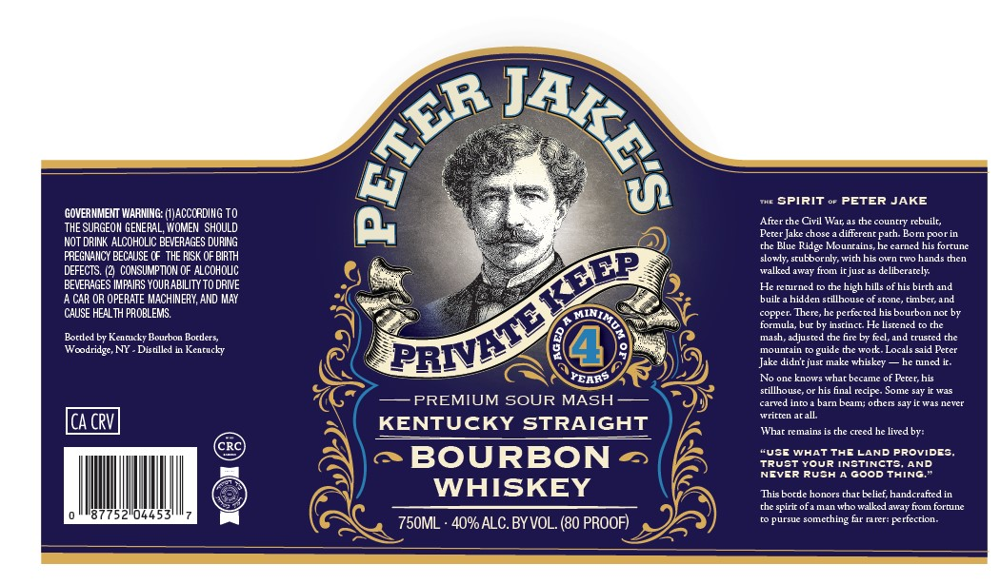

# TTB COLA Label Images - TTBID 26132001000942

**Brand Name:** PETER JAKE'S

**Issue Date:** 05/18/2026

**Origin Code:** 02

**Product Class/Type:** 101

**Source:** [TTB Public COLA Registry](https://ttbonline.gov/colasonline/viewColaDetails.do?action=publicFormDisplay&ttbid=26132001000942)

## Label Images

### Label 1

## Extracted Label Text

*Text extracted via OCR - may contain errors*

**Detected Proof:** 80

### Label 1

SpirIT
PETER JAKE
GOVERNMEIT WARMING: (ACCCRDING TO
Afterche Civil War;
dhecountt
rcbuilt,
THE SURGEOH GENERAL; WOMEN  SHOULD
Pcter Jake chose
diffcrent path
Foorin
NOT DRINK ALCOHOLIC BEVERAGES DURING
Ridge Mounrains
carned his fortune
FREGNAIICY BECAUSE CF  THE RISK OF BIRTH
slowly sruEbornly wirh his own rwo hands then
DEFECTS: (2 CONSUMPTION OF ALCOHOUC
walkedaway
tuom
irjust a5 delibcrarely
BEVERAGES IMPAIRS YOURABILITY TO DRIVE
Hcrctrned
high hills of his birch and
CAR OR OPERATE MACHINERY; AND MAY
builr _
hidden srillhouse of stone
Limbe
CHUSE HEAL TH PROBLEMS.
coFper: Thete, he pettected his bourbon nor by
tormula
bur bv Inscinct
Hc lisrened
Portled bv Kcnnkcky Bourbon Borders
mash; adjuste
the fire by fecl,and
rrusted the
Woodridge, NY
Distilled
Kencucky
mounrain
guide the work
Localsaaid Percr
Jake
didnrjus make whiskey
Jce nine
PCAR?
No one knows whar became
Peter; his
srillhouse,
his final recip - Some say
PREMIUM SOUR MASH
raled IniC
barn bcam; othets savidtTas ncvct
Wcicienaram
ICA CRV
KENTUCKY STRAIGHT
Temain:
che trced
he livedby:
Cdi
BOURBON
"USE WHATThELAND Provides
TRUSTYour I[NSTINCTS
AND
NGVER RUSh
Good THING
WHISKEY
This bordc honors thar Eclict, handcratted in
spirir of4 man whowalkelaway from fortune
0445
750ML
40% ALC.BY VOL. (80 PROOF)
UTSUe somcrhing tr [rr: pertecrion
NKES
(
Boru
TODP
PRIVATL
What
