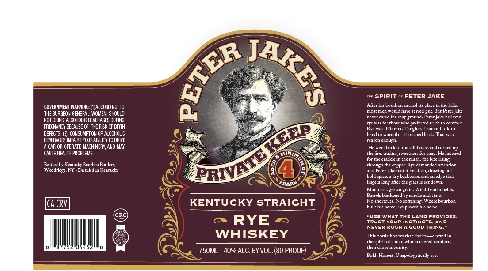

# TTB COLA Label Images - TTBID 26132001000943

**Brand Name:** PETER JAKE'S

**Issue Date:** 05/18/2026

**Origin Code:** 02

**Product Class/Type:** 102

**Source:** [TTB Public COLA Registry](https://ttbonline.gov/colasonline/viewColaDetails.do?action=publicFormDisplay&ttbid=26132001000943)

## Label Images

### Label 1

## Extracted Label Text

*Text extracted via OCR - may contain errors*

**Detected Proof:** 80

### Label 1

Spirit
PETER JAKE
GOVERNMEIT WARMING: (ACCCRDING TO
After his boubon
Aameu
place
che hills;
most mcn wouldhave sraved
pug Bur
Peter Jake
THE SURGEOM GENERAL; WOMEN  SHOULD
never cared for casy
gtound
Percr Jak belicved
NOT DRINK ALCOHOLIC BEVERAGES DURING
[Jc uas
chosttho
preterred
Frnni
comtort
FREGNAIICY BECAUSE CF  THE RISK OF BIRTH
Pvc was differenr
Toughcr: Leaner:_
didnt
DEFECTS: (2 CONSUMPTION OF ALCOHOUC
bene
tarmd
pushed back
Iharias
BEVERAGES IMPAIRS YOURABILITY TO DRIVE
rCason cnough
CAR OR OPERATE MACHINERY, AND MAY
Hcwenr back to the srillhous: and rurnedup
CAUSE HEAL TH PROBLEMS:
che nrc
rrading swcetness for snap. He lisccned
for thecrackke
chemash, te bire rising
Bortled bv Kcnnkck, Bourbon
Boctlers;
chrough checoppcr: Fve dcmanded atrcnrion
Wcodridge, NY
Distilled
Kcncucky
Kercr
Jake mec ic hcad-on, drawing our
bold spice
dry backbone
and an
edge thar
PCARS
lingers
after the gass
Scrdotn
Mountain
Wind Lraten helds:
Earcls backened
Smokeandcine
Ica CRV
KENTUCKY STRAIGHT
No shortcurs No softcning Whcrc bourbon
builr his namc,FYc
is nen
RUS
WHATThE LAND Providcs
RYE
TrUstYour [NSTInCTS
AND
NEVER RUsh
Good THING
WHISKEY
This borde honors that choice
Caatied
the spirir ot a man who mastered comtort;
(52
04452
chen choseinmensict
750ML . 40% ALC.BY VOL. (80 PROOF)
Bold. Honest. Unapologerically rye
NKES
(
TEP
PRWVETD
bne
Ziotn
goin
Moned
