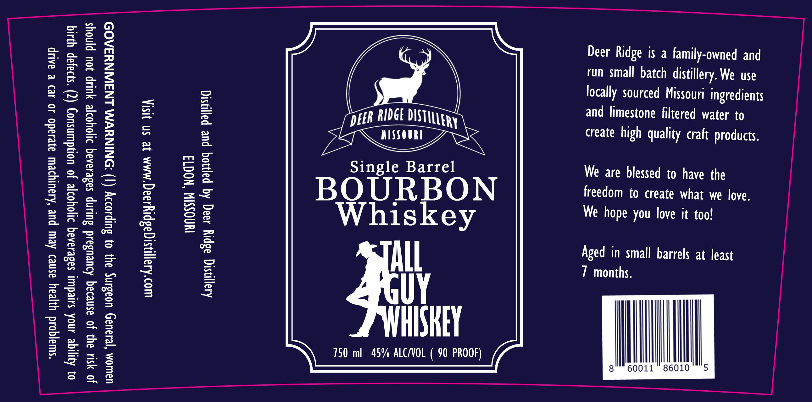

# TTB COLA Label Images - TTBID 26132001001011

**Brand Name:** DEER RIDGE DISTILLERY

**Issue Date:** 05/18/2026

**Origin Code:** 29

**Product Class/Type:** 141

**Source:** [TTB Public COLA Registry](https://ttbonline.gov/colasonline/viewColaDetails.do?action=publicFormDisplay&ttbid=26132001001011)

## Label Images

### Label 1

## Extracted Label Text

*Text extracted via OCR - may contain errors*

**Detected Proof:** 90

### Label 1

“swajqod yyjeay asne> Aew pur ‘Asauiysew ayesado 40 42) & aAUip
0} Ayjiqe anod suredun sadesaaaq rtoyorje jo uondwnsuoy (7) “s}oayap yyutq

Jo SIU ay) Jo asneraq Aueusard Suuunp sasesaaq djoyore YUP jou pjnoys

UdWOM ‘esauad uoasng 34} 0} Sulpsoooy (1) SONINYVM LNIJIAINYSAO9

woo Arajjiysigasplysaaq’MMM Je SN jISIA

IWNOSSIN ‘NOGT3
Arayasiq a8pry 499q Aq papioq pur palnsiq

, me |
peer RIDGE DISTILLERY
75 eR
Single Barrel

BOURBON
Whiskey

i
HISKEY

750 ml 45% ALC/VOL ( 90 PROOF)

Deer Ridge is a family-owned and
run small batch distillery. We use
locally sourced Missouri ingredients
and limestone filtered water to
create high quality craft products.

We are blessed to have the
freedom to create what we love.
We hope you love it too!

Aged in small barrels at least
7 months.

i
