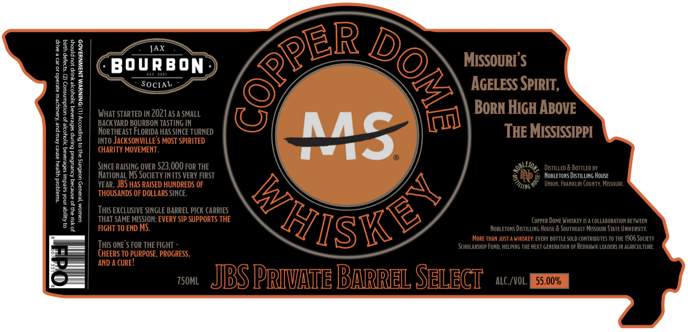
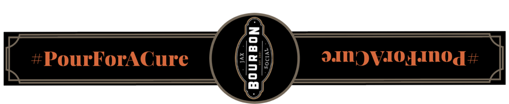

# TTB COLA Label Images - TTBID 26133001000042

**Brand Name:** COPPERDOME

**Issue Date:** 05/18/2026

**Origin Code:** 29

**Product Class/Type:** 140

**Source:** [TTB Public COLA Registry](https://ttbonline.gov/colasonline/viewColaDetails.do?action=publicFormDisplay&ttbid=26133001000042)

## Label Images

### Label 1

### Label 2

## Extracted Label Text

*Text extracted via OCR - may contain errors*

*1 image(s) excluded: text did not meet readability threshold*

**Detected Proof:** 110

### Label 1

5
JAX
0
H
BOURBBON
MISSOURI $
1
SOCIAL
AGELESS SPIRIT;
H
H
What STARTED IN 2021AS A SMALL
BoRN HIGH ABovE
BACK YARD BOURBON TASTING IN
1
NoRTHeast FLORIDA HAS SINCE TURNED
MS
THE MISSISSIPPI
1
2
INTO JacKSONVILLE '$ MOST SPIRITED
CHARITY MOVEMENT .
3
5
M
SINce RAISING OVER 523,000 FOR THE
ETot  DISTILLed & BoTTLED BY
NatIonal MS Society IN ITS VeRY FIRST
Mb
NoBLETOUs Distilling House
H
L
YEAR , JBS HAS RAISED HUNDREDS OF
Union, FranKLIn County; Missour,
0
THOUSANDS OF DOLLARS SINCE.
8
8
I
Thas SXGLESVESONGEVERPSIP S@pporTbRTEE
<hSKEY
CopPER DoMe Whiskev IS
COLLABORATION BETWEEN
2
FIGHT TO END MS.
NoBLETONs Distilling House & Southeast Missouri StAte UNvERSLTY;
MorE THAN JUST A WHSKEY: EVERY BOTTLe SOLD CONTRIBUTES TO THE 1906 SOcIETY
This onE'$ FOR THE FIGHT
ScholarshIp Fund, HELPING THE NeXT GEMERATIOM OF Redhawk LEADERs IM AGRICULTURE,
CHEERS TO PURPOSE , PROGRESS ,
AND A CURE!
0
750ML
JBS PRIvAte Barrel SeLeci
alC /VOL;
55.00%
CPPER
2
8
8
FostillIS
