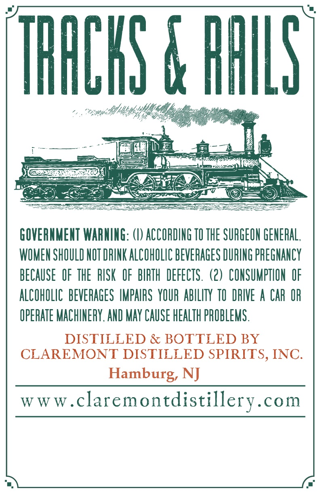

# TTB COLA Label Images - TTBID 26133001000180

**Brand Name:** TRACKS & RAILS

**Issue Date:** 05/20/2026

**Origin Code:** 03

**Product Class/Type:** 101

**Source:** [TTB Public COLA Registry](https://ttbonline.gov/colasonline/viewColaDetails.do?action=publicFormDisplay&ttbid=26133001000180)

## Label Images

### Back Label

## Extracted Label Text

*Text extracted via OCR - may contain errors*

### Back Label

THACHS € HHLS
GOVERMMENT WARNING: () ACCORDING TO THE SURGEOH GENERAL ,
WOMEN SHOULD NOT DRINK ALCOHOLIC BEVERAGES DURING PREGNANCY
BECAUSE   OF THE   RISK   OF   BIRTH  DEFECTS . (2) CONSUMPTHON  OF
ALCOHOLIC   BEVERAGES IMPAIRS  YOUR AbILITy TO  DRIVE a CAR OR
OPERATE MACHINERY, AND MAY CAUSE HEALTH PROBLEMS .
DISTILLED & BOTTLED BY
CLAREMONT DISTILLED SPIRITS, INC.
Hamburg, NJ
W W W _
 claremontdistillery.com
