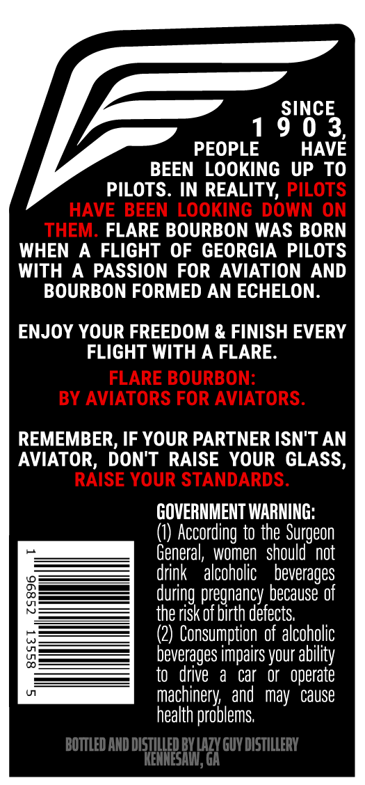
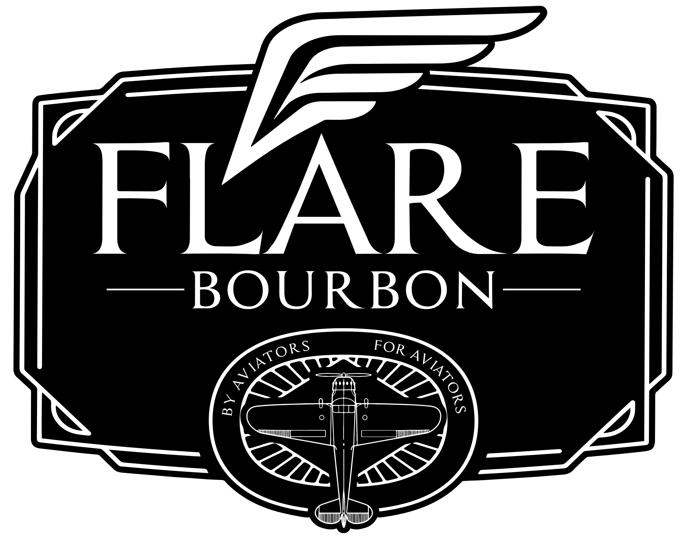
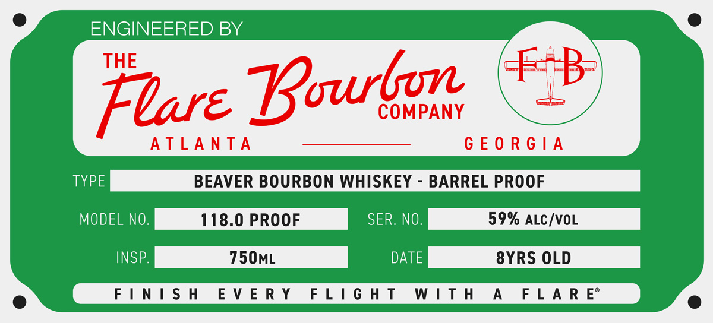

# TTB COLA Label Images - TTBID 26133001000279

**Brand Name:** BEAVER

**Issue Date:** 05/20/2026

**Origin Code:** 08

**Product Class/Type:** 141

**Source:** [TTB Public COLA Registry](https://ttbonline.gov/colasonline/viewColaDetails.do?action=publicFormDisplay&ttbid=26133001000279)

## Label Images

### Back Label

### Front Label

### Label 2

### Label 4

## Extracted Label Text

*Text extracted via OCR - may contain errors*

*1 image(s) excluded: text did not meet readability threshold*

**Detected Proof:** 118
**Detected Age:** 8 Years

### Back Label

SINCE
1
9 0 3
PEOPLE
HAVE
BEEN LOOKING UP TO
PILOTS. IN REALITY, PILOTS
HAVE BEEN LOOKING DOWN ON
THEM. FLARE BOURBON WAS BORN
WHEN
A FLIGHT OF GEORGIA PILOTS
WITH
A
PASSION FOR AVIATION
AND
BOURBON FORMED AN ECHELON_
ENJOY YOUR FREEDOM & FINISH EVERY
FLIGHT WITH A FLARE
FLARE BOURBON:
BY AVIATORS FOR AVIATORS.
REMEMBER, IF YOUR PARTNER ISN'T AN
AVIATOR, DON'T RAISE YOUR GLASS,
RAISE YOUR STANDARDS.
GOVERNMENT WARNING:
According to the Surgeon
General,  women   should'  not
drink
alcoholic   beverages
{
during pregnancy because of
the risk of birth defects;
(2) Consumption of alcoholic
0
beverages impairs your
to   drive
a
car   or   operate
machinery , and   may  cause
health problems
BOTTLED AND DISTILLED BYE
LazY Guy dIstiery
KENNESAIL,
ability

### Label 2

REMOVE AFTER FLARE AMV 14 YALIV JAOWIY

### Label 4

ENGINEERED BY

TYPE

BEAVER BOURBON WHISKEY - BARREL PROOF

MODEL NO.

118.0 PROOF

SER. NO

INSP.

750ML

DATE

8YRS OLD

FINISH

EVERY FLIGHT WITH A

FLARE
