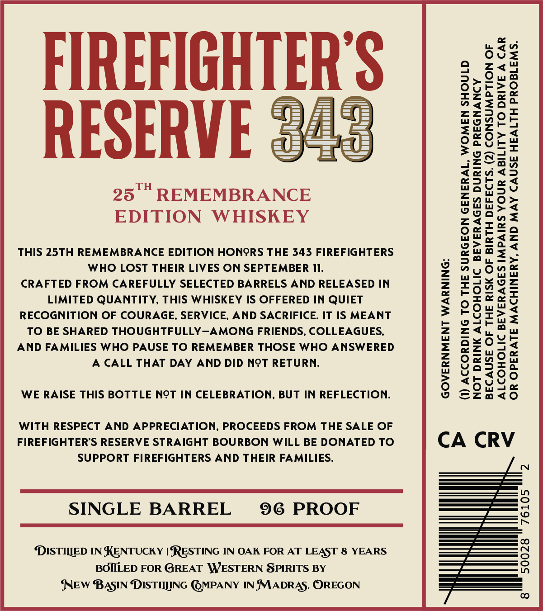
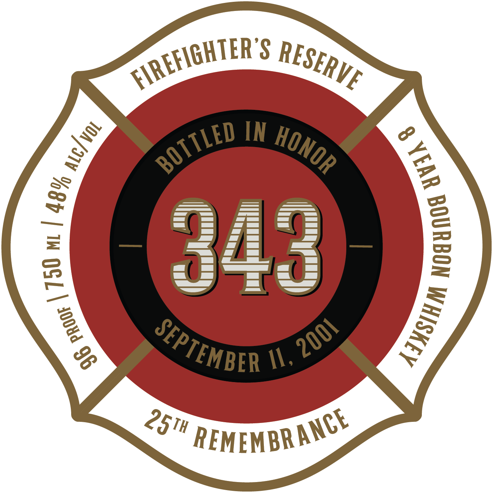

# TTB COLA Label Images - TTBID 26133001000305

**Brand Name:** FIREFIGHTER'S RESERVE 343 BOURBON

**Issue Date:** 05/21/2026

**Origin Code:** 38

**Product Class/Type:** 141

**Source:** [TTB Public COLA Registry](https://ttbonline.gov/colasonline/viewColaDetails.do?action=publicFormDisplay&ttbid=26133001000305)

## Label Images

### Back Label

### Front Label

## Extracted Label Text

*Text extracted via OCR - may contain errors*

*1 image(s) excluded: text did not meet readability threshold*

**Detected Proof:** 96
**Detected Age:** 8 Years

### Back Label

ngu

Oust

zd

FIREFIGHTER

2>

Oua

E20

OU

rzZoee

=

zat

zzJ2

wo

zea

oF

a

“2o>d

—

aor

S35

RESERVE

=a he

Zo

aa

ASw

zany

tends

waysy

eD>hred

25'" REMEMBRANCE

nu O>

Wu > <

EDITION WHISKEY

ga

n=

zd

eEe=-a

uWedZz

THIS 25TH REMEMBRANCE EDITION HONORS THE 343 FIREFIGHTERS

Zias<

>%u.=>

WHO LOST THEIR LIVES ON SEPTEMBER Il.

"40"

CRAFTED FROM CAREFULLY SELECTED BARRELS AND RELEASED IN

w=

wAx~oz

ZoYa

LIMITED QUANTITY, THIS WHISKEY IS OFFERED IN QUIET

riee

20

UL

ww

RECOGNITION OF COURAGE, SERVICE, AND SACRIFICE. IT IS MEANT

olapu

TO BE SHARED THOUGHTFULLY—AMONG FRIENDS, COLLEAGUES,

zi,

AND FAMILIES WHO PAUSE TO REMEMBER THOSE WHO ANSWERED

axxo

a<

eZuy

A CALL THAT DAY AND DID NOT RETURN.

Onn

YVadta

og

feKe)

tk

On2e

WE RAISE THIS BOTTLE NOT IN CELEBRATION, BUT IN REFLECTION.

za<to

WITH RESPECT AND APPRECIATION, PROCEEDS FROM THE SALE OF

FIREFIGHTER’S RESERVE STRAIGHT BOURBON WILL BE DONATED TO

CA CRV

SUPPORT FIREFIGHTERS AND THEIR FAMILIES.

SINGLE BARREL

96 PROOF

DISTIIED IN KENTUCKY | RESTING IN OAK FOR AT LEAST 8 YEARS

BOILED FOR GREAT \WESTERN SPIRITS BY

SNEW BASIN DISTII[ING @MPANY IN MADRAS, OREGON
