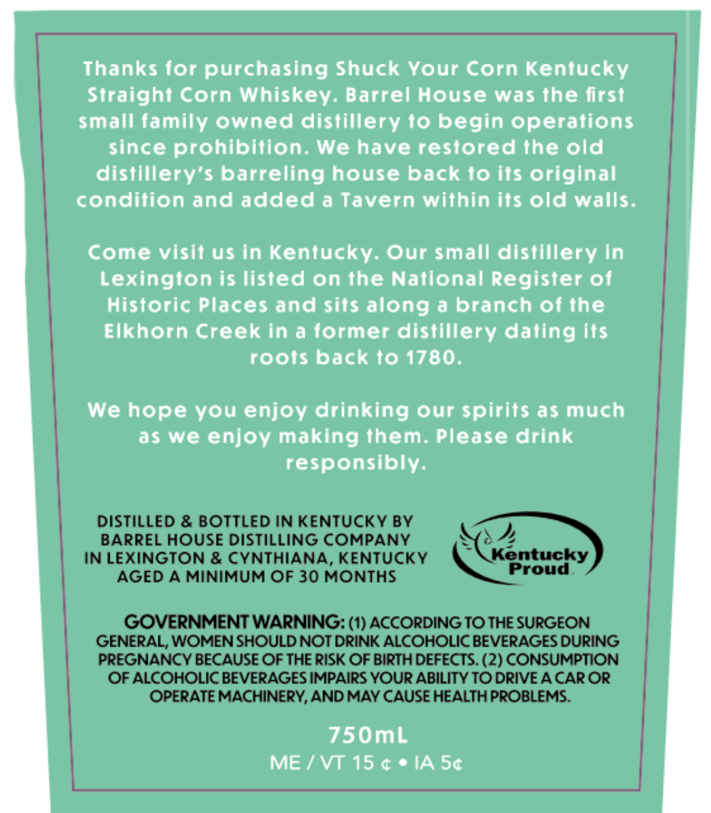
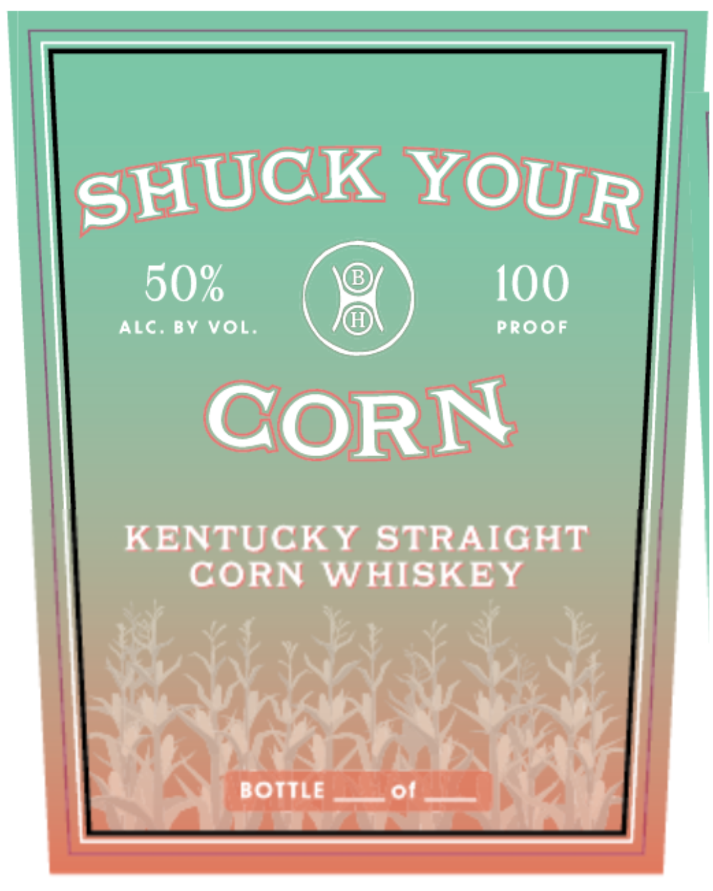

# TTB COLA Label Images - TTBID 26133001000338

**Brand Name:** SHUCK YOUR CORN

**Issue Date:** 06/10/2026

**Origin Code:** 22

**Product Class/Type:** 103

**Source:** [TTB Public COLA Registry](https://ttbonline.gov/colasonline/viewColaDetails.do?action=publicFormDisplay&ttbid=26133001000338)

## Label Images

### Back Label

### Front Label

## Extracted Label Text

*Text extracted via OCR - may contain errors*

**Detected Proof:** 100

### Back Label

Thanks for purchasing Shuck Your Corn Kentucky
Straight Corn Whiskey. Barrel House was the first
small family owned distillery to begin operations
since prohibition. We have restored the old
distillery’s barreling house back fo its original
condition and added a Tavern within its old walls.

Come visit us in Kentucky. Our small distillery in
Lexington is listed on the National Register of
Historic Places and sits along a branch of the
Elkhorn Creek in a former distillery dating its
roots back to 1780.

We hope you enjoy drinking our spirits as much
as we enjoy making them. Please drink
responsibly.

DISTILLED & BOTTLED IN KENTUCKY BY
BARREL HOUSE DISTILLING COMPANY
IN LEXINGTON & CYNTHIANA, KENTUCKY re
AGED A MINIMUM OF 30 MONTHS Proud
GOVERNMENT WARNING: (1) ACCORDING TO THE SURGEON
GENERAL, WOMEN SHOULD NOT DRINK ALCOHOLIC BEVERAGES DURING
PREGNANCY BECAUSE OF THE RISK OF BIRTH DEFECTS. (2) CONSUMPTION
OF ALCOHOLIC BEVERAGES IMPAIRS YOUR ABILITY TO DRIVE A CAROR
OPERATE MACHINERY, AND MAY CAUSE HEALTH PROBLEMS.

750mL
ME/VT 15¢elA5¢

### Front Label

HUCK YOUR

50%

100

ALC. BY VOL

PROOF

CORN

KENTUCKY STRAIGHT

CORN WHISKEY

£22745 47

wenn rEWrS ah

rh

Ss

BOTTLE

AIDING AS

aw wea
