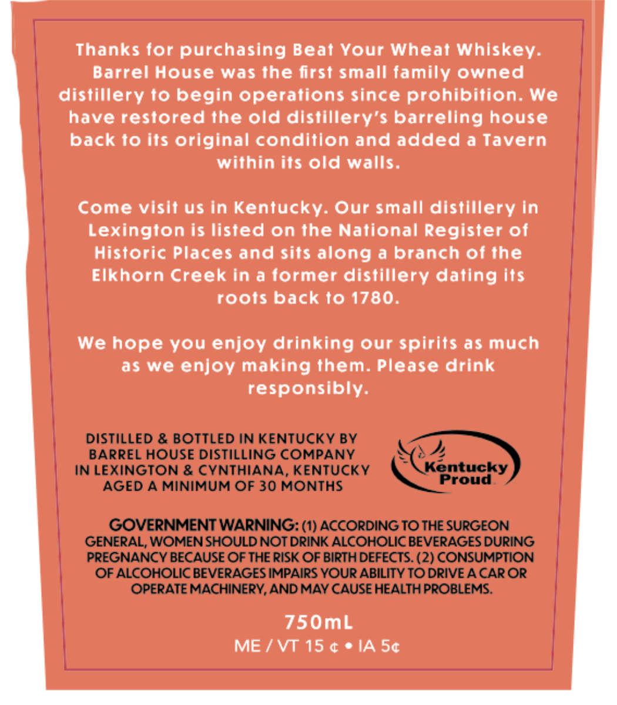
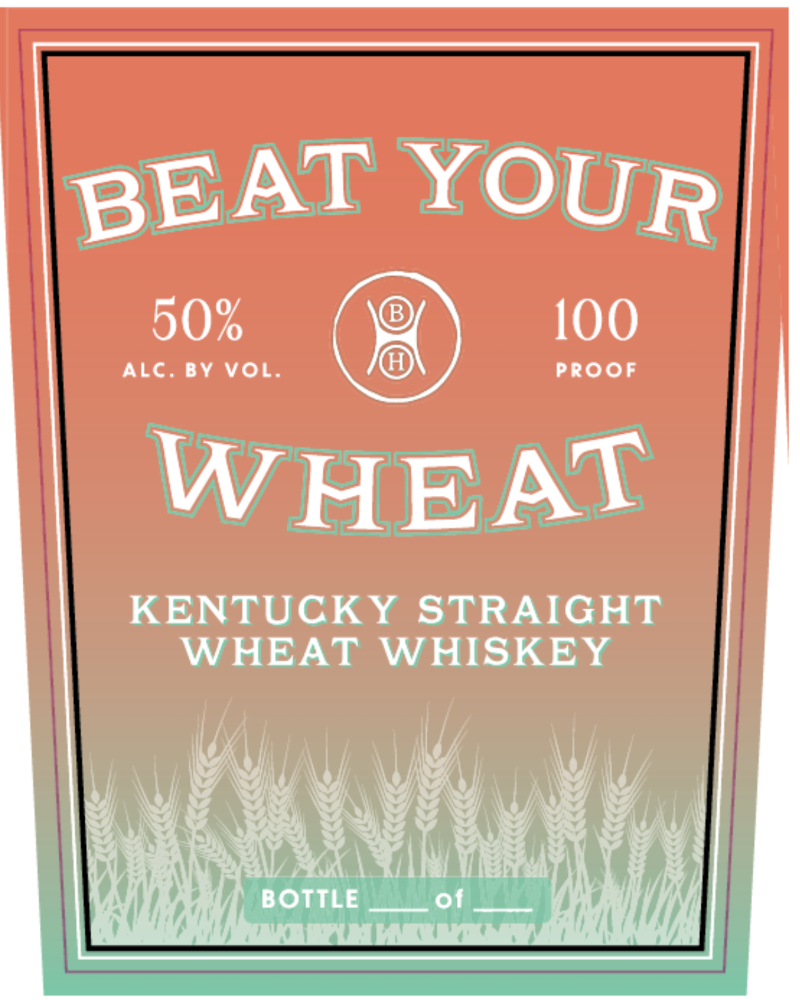

# TTB COLA Label Images - TTBID 26133001000356

**Brand Name:** BEAT YOUR WHEAT

**Issue Date:** 06/10/2026

**Origin Code:** 22

**Product Class/Type:** 109

**Source:** [TTB Public COLA Registry](https://ttbonline.gov/colasonline/viewColaDetails.do?action=publicFormDisplay&ttbid=26133001000356)

## Label Images

### Back Label

### Front Label

## Extracted Label Text

*Text extracted via OCR - may contain errors*

### Back Label

Thanks for purchasing Beat Your Wheat Whiskey:
Barrel House was the first small family owned
distillery t0 begin operations since prohibition. We
have restored the old distillery'$ barreling house
back t0 its original condition and added a Tavern
within its old walls.
Come visif us in Kentucky: Our small distillery In
Lexington is listed on the National Register of
Historic Places and sits along a branch of the
Elkhorn Creek in a former distillery dating its
roots back t0 1780.
We hope you enjoy drinking our spirits as much
as we enjoy making them: Please drink
responsibly:
DISTILLED & BOTTLED IN KENTUCKY BY
BARREL HOUSE DISTILLING COMPANY
IN LEXINGTON & CYNTHIANA, KENTUCKY
Kontucky
Proud
AGED A MINIMUM OF 30 MONTHS
GOVERNMENT WARNING: (1) ACCORDING TO THE SURGEON
GENERAL; WOMEN SHOULD NOT DRINK ALCOHOLIC BEVERAGES DURING
PREGNANCY BECAUSE OF THE RISK OF BIRTH DEFECTS. (2) CONSUMPTION
OF ALCOHOLIC BEVERAGES IMPAIRS YOUR ABILITY TO DRIVE A CAROR
OPERATE MACHINERY, AND MAY CAUSE HEALTH PROBLEMS.
750mL
ME
VT 15 (
IA 50

### Front Label

KENTUCKY STRAIGHT |
WHEAT WHISKEY |
S4\Ce) BAS) CARS, 34 SRS) f\ | RAS v4
Coat ANH
MIRNA) BOTTLE ___ of Wah / Yh
GAL Nba ur vara rca LALLA
