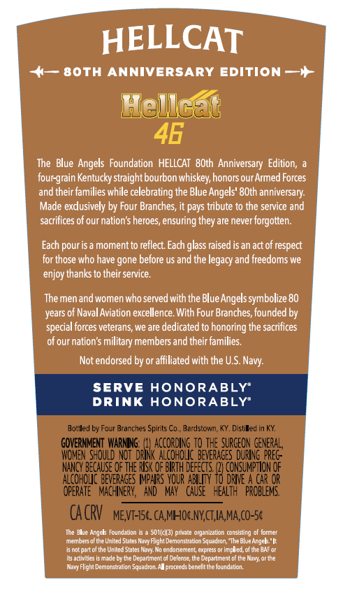
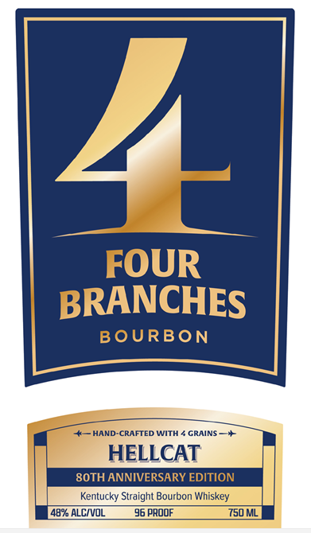
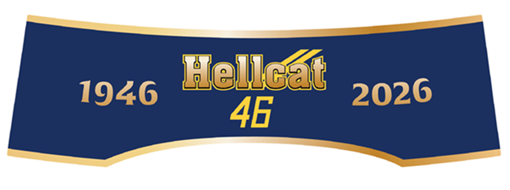

# TTB COLA Label Images - TTBID 26133001000476

**Brand Name:** FOUR BRANCHES

**Issue Date:** 06/02/2026

**Origin Code:** 22

**Product Class/Type:** 101

**Source:** [TTB Public COLA Registry](https://ttbonline.gov/colasonline/viewColaDetails.do?action=publicFormDisplay&ttbid=26133001000476)

## Label Images

### Back Label

### Label 1

### Label 2

### Label 3

## Extracted Label Text

*Text extracted via OCR - may contain errors*

*2 image(s) excluded: text did not meet readability threshold*

### Back Label

HELLCAT
8oth ANNIVERSARY EDITION
Hellcat
46
The Blue Angels Foundation  HELLCAT  8Oth  Anniversary   Edition;
four-grain Kentucky straightbourbon whiskey; honors our Armed Forces
andtheir families while
celebrating the Blue Angels' 8Oth anniversary:
Made exdusively by
Branches, it pays tribute to the service
sacrifices of our nation s heroes, ensuring they are never forgotten.
Each pouris =
moment to reflect Each glass raised isan act of respect
for those who have gone before us and the
and freedoms we
enjoy thanks to their service.
The men and women who served with the Blue Angels symbolize 80
years of Naval Aviation excellence. With Four Branches; founded by
special forces veterans, we are dedicated to honoring the sacrifices
of our nation'$ military members and their families
Not endorsed by or affiliated with the US.
SERVE HONORABLY'
DRINK HONORABLY'
Botlled by Four Brarches Spir ts Co.
Bardstovan, KY. Distiled In KY
GOVERNMENT  WARNIG:
ACcORdINg TO ThE SURGEON GeNeRAL,
WOMEN S4ould NOI DriNk AlcoholIc beverages DurINg preg":
NANcY BEcAUSE QF ThE RI5< Qe BIrth deeecis _
#EAeR Uror
ALCOHOLC BEVERAGES MPhRS  YOUR AbLLITy
DRIVE
C4R OR
OFERATE ^ MchNERY, ^ And
MAY   CHUSE
FEalth   pRobiels
CA CRV
MEVT-ISC. CAMHOCNYCTIA,Ma,co-5c
The Dlue Argcks Fc undation
S01/cK3) pmare organizabon
@omsisuig
Molme
Members of the United States Mavy Flight Demonstration Squadion; "Th? Blue Anges ' It
Is not part cl the Unlled States Naty
endorsement; express Or Impuled ol thc BAF or
iBs activibies is made by the Deparunent el Delense, the Depattment 0f tne Mary; or be
Flight Demcnstration Sq acron Alpromeds benelitthefoundalion_
Four
and
legacy
Navy:
Mon"

### Label 1

FOUR
BRANCHES
BOURBON
HAND-CRAFTED WITH
GRAINS =
HELLCAT
8OTH ANNIVERSARY EDITION
Kentucky Straight Bourbon Whiskey
482 ALCIVoL
96 prOQF
ys0ML
