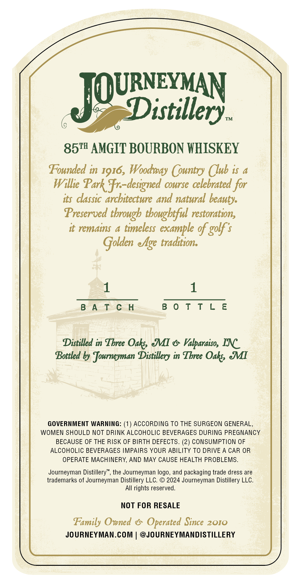
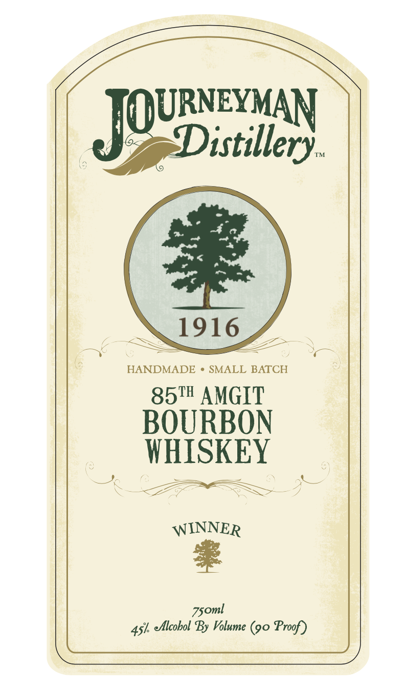

# TTB COLA Label Images - TTBID 26133001000478

**Brand Name:** JOURNEYMAN DISTILLERY

**Fanciful Name:** 85TH AMGIT BOURBON WHISKEY

**Issue Date:** 05/26/2026

**Origin Code:** 06

**Product Class/Type:** 141

**Source:** [TTB Public COLA Registry](https://ttbonline.gov/colasonline/viewColaDetails.do?action=publicFormDisplay&ttbid=26133001000478)

## Label Images

### Back Label

### Front Label

## Extracted Label Text

*Text extracted via OCR - may contain errors*

**Detected Proof:** 90

### Back Label

JQUaay
TM
851 AMGIT BOURBON WHISKEY
Founded in
Woodwas Country Club is
Willie Park Fr-designed course celebrated for
its classic architecture and natural beauty:
Preserved tbrough tbougbtful restoration,
it remains
timeless
example %f golf $
Golden elge traditiona
8 A T € H
8 0 T T L E
Distilled in Tbree Oaks &I
Valpardiso, INC
Bottled by Journeyman Distillery in Tbree Oaks JI
GOVERNMENT WARNING:
ACCORDING To THE SURGEON GENERAL
WOMEN SHOULD NOT DRINK ALCOHOLIC BEVERAGES DURING PREGNANCY
BECAUSE OF THE RISK OF BIRTH DEFECTS. (2) CONSUMPTION OF
ALCOHOLIC BEVERAGES IMPAIRS YOUR ABILITY TO DRIVE A CAR OR
OPERATE MACHINERY, AND MAY CAUSE HEALTH PROBLEMS.
Journeyman Distillery"
the Journeyman logo, and packaging trade dress are
trademarks of Journeyman Distillery LLC.
2024 Journeyman Distillery LLC.
AIl rights reserved.
NOT FOR RESALE
Family Omned
Operated Since 2010
JOURNEYMAN.COM
@JOURNEYMANDISTILLERY
I916,

### Front Label

Distillery_
TM
1916
HANDMADE
SMALL BATCH
85TH AMGIT
BOURBON
WHISKEY
WINNER
4s1
Alcobol By Volume (90 Proof)
JOURNEYMAN
Zsoml
