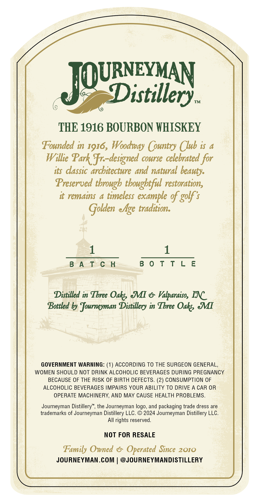
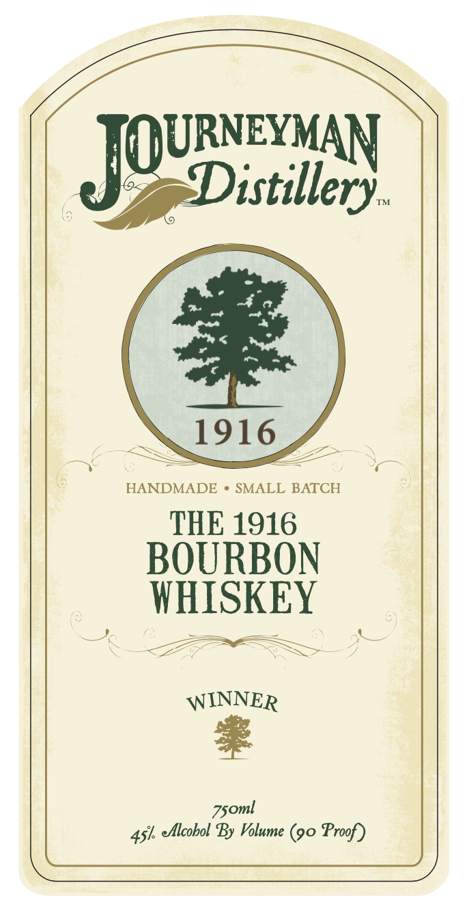

# TTB COLA Label Images - TTBID 26133001000483

**Brand Name:** JOURNEYMAN DISTILLERY

**Fanciful Name:** THE 1916 BOURBON WHISKEY

**Issue Date:** 05/22/2026

**Origin Code:** 06

**Product Class/Type:** 141

**Source:** [TTB Public COLA Registry](https://ttbonline.gov/colasonline/viewColaDetails.do?action=publicFormDisplay&ttbid=26133001000483)

## Label Images

### Back Label

### Front Label

## Extracted Label Text

*Text extracted via OCR - may contain errors*

**Detected Proof:** 90

### Back Label

URNEYMAN

istillery..

THE 1916 BOURBON WHISKEY

Founded in 1916, Woodway (ountry (lub is a

Wilke Park. designed course celebrated for

its classic architecture and natural beauty.

Preserved through thoughtful restoration,

it remains a timeless example of golf's

Golden eAge tradition.

1

1

BATCH

BOTTLE

Distilled in Three Oak, IMI e Valparaiso, INC

Bottled by Journeyman Distillery in Three Oaks, MI

GOVERNMENT WARNING: (1) ACCORDING TO THE SURGEON GENERAL,

WOMEN SHOULD NOT DRINK ALCOHOLIC BEVERAGES DURING PREGNANCY

BECAUSE OF THE RISK OF BIRTH DEFECTS. (2) CONSUMPTION OF

ALCOHOLIC BEVERAGES IMPAIRS YOUR ABILITY TO DRIVE A CAR OR

OPERATE MACHINERY, AND MAY CAUSE HEALTH PROBLEMS.

Journeyman Distillery”, the Journeyman logo, and packaging trade dress are

trademarks of Journeyman Distillery LLC. © 2024 Journeyman Distillery LLC.

All rights reserved.

NOT FOR RESALE

Family Owned & Operated Since 2010

JOURNEYMAN.COM | @JOURNEYMANDISTILLERY

### Front Label

Distillery_
TM
1916
HANDMADE
SMALL BATCH
THE 1916
BOURBON
WHISKEY
WINNER
Alcobol By Volume (90 Proof)
JOURNEYVAN
Zsoml
47
