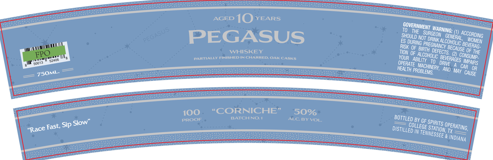
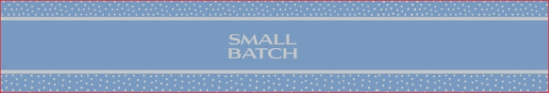

# TTB COLA Label Images - TTBID 26133001000500

**Brand Name:** PEGASUS

**Fanciful Name:** "CORNICHE"

**Issue Date:** 05/20/2026

**Origin Code:** 44

**Product Class/Type:** 140

**Source:** [TTB Public COLA Registry](https://ttbonline.gov/colasonline/viewColaDetails.do?action=publicFormDisplay&ttbid=26133001000500)

## Label Images

### Label 1

### Label 2

## Extracted Label Text

*Text extracted via OCR - may contain errors*

*1 image(s) excluded: text did not meet readability threshold*

### Label 1

SURE ESS oS GOVERNMENT WARNING: (1) ACCORDING
See eae ee ete he TO THE Sungei GENERAL, “Wome
siege ioe censuetoesen eee So A SHOULD OE DRINK AL Conant BEVERAG.
aunts =-D1(0) Years ES DURING TT PUY Beohge pe Me
oops eueacaetae AGED JU a Fok GF STH DerEcre (2) Cousuyp.
seer mons AGI Ic > TION OF ALCoHoL¢ PEVERAGES pans
ere een =Y any, ILS YOUR ABILITY 19 DRIVE A cap OR
grereertamne >) = 5 fs-AN_ OPERATE MACHINERY AND. May CAUSE
Meee | —— < HEALTH PROBLEM,
so . ee OAK CASKS see — —— coe Le
Te FINISHED IN CHAR == Se ids CEG Laer! ae
— PARTIALEY EI = ee ae ih saeete tee Se ee ~ cS ee
hl : Un ee —— a :
jun Hu Z Ree: vee serrata —____ — aye
5 Tene Sine ——__ cia aa es na =a
52408 ee oes =—_— EER EUR GOR a
ese rete Ges a BOTTLED BY GF spare OPERATING,
8 750ML- = —~ oeeieo os oe sapsrleae sea —= pes 50% — COLLEGE STATION, IX - =—
a= ee exaquememimanans ethos Persia DISTILLED iy TENNESSEE 8 NDI ayg
Cie ee eens 100 “© BATCHNG.4 — ee ——— = ll , rf
peer : ana a PROOF = cure ar cir pen ey tee OSSE NT
——— 4p SOW” — Poeun aees adams
w Fast, Sip SI - peers —
“Race — ee se ———
