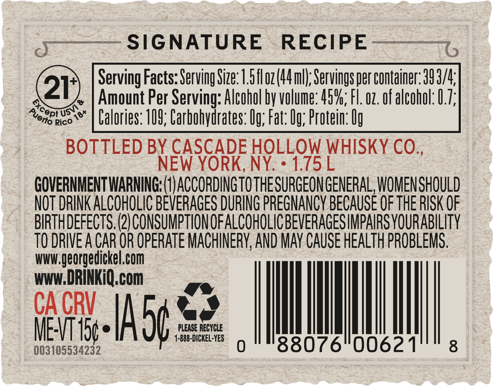
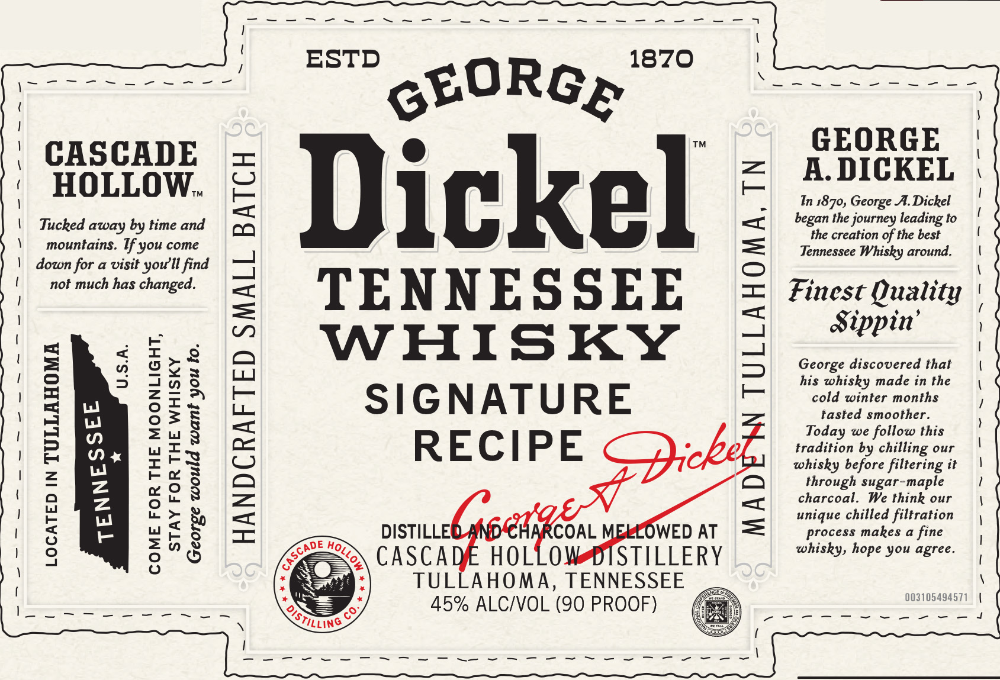
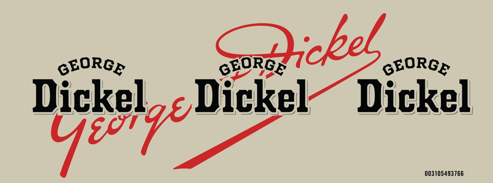

# TTB COLA Label Images - TTBID 26133001000514

**Brand Name:** GEORGE DICKEL

**Fanciful Name:** SIGNATURE RECIPE

**Issue Date:** 05/18/2026

**Origin Code:** 04

**Product Class/Type:** 140

**Source:** [TTB Public COLA Registry](https://ttbonline.gov/colasonline/viewColaDetails.do?action=publicFormDisplay&ttbid=26133001000514)

## Label Images

### Back Label

### Label 1

### Label 2

## Extracted Label Text

*Text extracted via OCR - may contain errors*

**Detected Proof:** 90

### Back Label

yo « SIGNATURE RECIPE ———.,
Serving Facts: Serving Size: 1.5fl o7(44 ml); Servings per container: 39 3/4;
a | Amount Per Serving: Alcohol by volume: 45%, Fl. 02. of alcohol: 0.7;
Yonetco™ | Calories: 109; Carbohydrates: Og; Fat: 0g; Protein: Og
BOTTLED BY CASCADE HOLLOW WHISKY CO.,
NEW YORK, NY. « 1.75 L

GOVERNMENT WARNING: (1) ACCORDING TO THE SURGEON GENERAL, WOMEN SHOULD
NOT DRINK ALCOHOLIC BEVERAGES DURING PREGNANCY BECAUSE OF THE RISK OF
BIRTHDEFECTS. (2) CONSUMPTION OF ALCOHOLIC BEVERAGES IMPAIRS YOURABILITY
TO DRIVE A CAR OR OPERATE MACHINERY, AND MAY CAUSE HEALTH PROBLEMS.
ri ORI com

WWW. DRINKiQ.com

ge
ME-VT 15¢ e PLEASE RECYCLE
asieaeamne 1-888-DICKEL-YES a) 88076 0062 1 8

### Label 1

CASCADE
HOLLOW.

Tucked away by time and
mountains. If you come
down for a visit youll find
not much has changed.

U.S.A.

—q
=
i=)
=)
eq
=
=
i=)
e
Z
a
Lt)
Ee
<x
rs)
°
a

COME FOR THE MOONLIGHT,
STAY FOR THE WHISKY
George would want you to.

Dickel

TENNESSEE
WHISKY

SIGNATURE

RECIPE Pricke

DISTILLE!
CASCA
TULLAHOMA, TENNESSEE
45% ALC/VOL (90 PROOF)

ADE WN TULLAHOMA, TN

GEORGE
A. DICKEL

Tn 1870, George A. Dickel
began the journey leading to
the creation of the best
Tennessee Whisky around.

Finest Quality
Sippin’

George discovered that
his whisky made in the
cold winter months
tasted smoother.
Today we follow this
tradition by chilling our
whisky before filtering it
through sugar-maple
charcoal. We think our
unique chilled filtration
process makes a fine
whisky, hope you agree.

### Label 2

GEORGE
GEORGE
OcbeL.
GEORGE
Dickel
Dickel
Dickel  E
003105493766
