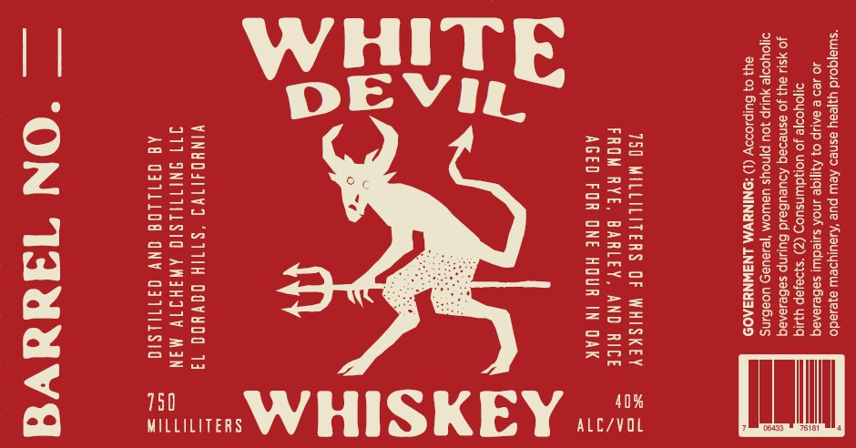

# TTB COLA Label Images - TTBID 26133001000530

**Brand Name:** WHITE DEVIL

**Issue Date:** 05/21/2026

**Origin Code:** 01

**Product Class/Type:** 140

**Source:** [TTB Public COLA Registry](https://ttbonline.gov/colasonline/viewColaDetails.do?action=publicFormDisplay&ttbid=26133001000530)

## Label Images

### Front Label

### Label 2

## Extracted Label Text

*Text extracted via OCR - may contain errors*

*1 image(s) excluded: text did not meet readability threshold*

**Detected Proof:** 80

### Front Label

“suiajqoud yajeay esneo Aew pue ‘Aueurypew ayeiedo
40 429  AALip 0} Auge 4NOK sured) saBe1aAaq
yodye Jo uoKAduinsuod (Z) ‘s}a}ep YUIG
uy] Jo asneoaq AoueuBaid Bulinp saBe1anaq
difo\yooye YUUP 0U PINoYs UaWOM ‘TeleUaD UoaBins
84} 0 Sulpioooy (1) “ONINNWM LNAWNY3AOD

750 MILLILITERS OF WHISKEY
FROM RYE, BARLEY, AND RICE
AGED FOR ONE HOUR IN DAK

40%
ALC/VOL

WHISKEY

VINHOSITVI “STIIH DOVHOO 13
J17 INITWLSIG AWGHITVY MAN
AQ Q311108 ONY Q31TILSId

WILLILITERS

75D

— “ON TauuVE
