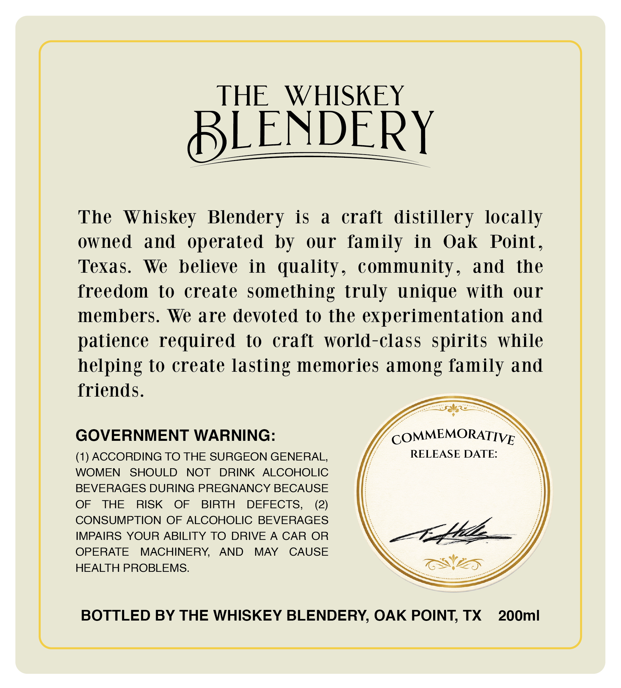

# TTB COLA Label Images - TTBID 26133001000714

**Brand Name:** THE WHISKEY BLENDERY

**Issue Date:** 05/19/2026

**Origin Code:** 44

**Product Class/Type:** 121

**Source:** [TTB Public COLA Registry](https://ttbonline.gov/colasonline/viewColaDetails.do?action=publicFormDisplay&ttbid=26133001000714)

## Label Images

### Back Label

## Extracted Label Text

*Text extracted via OCR - may contain errors*

### Back Label

THE
WHISKEY
BLENDERY
The   Whiskey Blendery
is
a
craft
distillery locally
owned
and  operated  by
ouur
family
in
Oak
Point _
Texas.
We
believe
in
quality _
community_
and
the
freedom
to
create
something truly unique  with
our
members. We are devoted to the
experimentation and
patience required
to
craft
world-class  spirits
while
helping to create lasting memories among family and
friends.
GOVERNMENT WARNING:
COMMEMORATIVE
(1) ACCORDING TO THE SURGEON GENERAL;
RELEASE DATE:
WOMEN
SHOULD
NOT
DRINK
ALCOHOLIC
BEVERAGES DURING PREGNANCY BECAUSE
OF
THE
RISK
OF
BIRTH
DEFECTS,
(2)
CONSUMPTION
OF ALCOHOLIC BEVERAGES
IMPAIRS YOUR ABILITY TO DRIVE
A
CAR
OR
274/
OPERATE
MACHINERY
AND
MAY
CAUSE
HEALTH PROBLEMS:
BOTTLED BY THE WHISKEY BLENDERY, OAK POINT; TX
200ml
