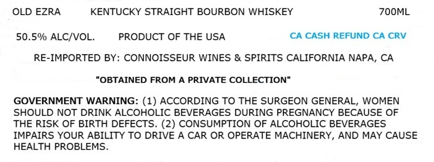
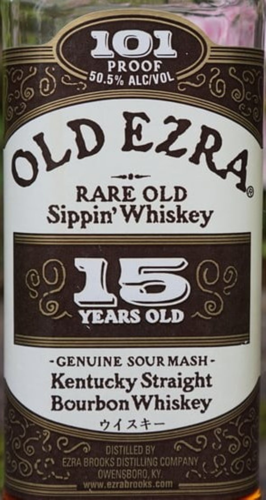

# TTB COLA Label Images - TTBID 26133001000730

**Brand Name:** OLD EZRA

**Fanciful Name:** 15 YEARS OLD

**Issue Date:** 05/20/2026

**Origin Code:** 22

**Product Class/Type:** 101

**Source:** [TTB Public COLA Registry](https://ttbonline.gov/colasonline/viewColaDetails.do?action=publicFormDisplay&ttbid=26133001000730)

## Label Images

### Label 1

### Label 2

## Extracted Label Text

*Text extracted via OCR - may contain errors*

**Detected Proof:** 101

### Label 1

OLD EZRA
KENTUCKY STRAIGHT BOURBON WHISKEY
7OOML
50.5% ALCIVOL:
PRODUCT OF THE USA
CA CASH REFUND CA CRV
RE-IMPORTED BY: CONNOISSEUR WINES & SPIRITS CALIFORNIA NAPA, CA
"OBTAINED FROM A PRIVATE COLLECTION"
GOVERNMENT WARNING: (1) ACCORDING TO THE SURGEON GENERAL, WOMEN
SHOULD NOT DRINK ALCOHOLIC BEVERAGES DURING PREGNANCY BECAUSE OF
THE RISK OF BIRTH DEFECTS. (2) CONSUMPTION OF ALCOHOLIC BEVERAGES
IMPAIRS YOUR ABILITY TO DRIVE A CAR OR OPERATE MACHINERY, AND MAY CAUSE
HEALTH PROBLEMS

### Label 2

10z
PROOF
AlcivOL
RARE OLD
Sippin' Whiskey
@0
3@
YEARS OLD
L
GENUINE SOUR MASH -
Kentucky Straight
Bourbon Whiskey
747+-
distilleD BY
EZRA BROOKS DISTILLING ComPANY
OWENSBORO; KV
aruud ezrdntooks Gom
50.5%
EZRA
OLD
1
