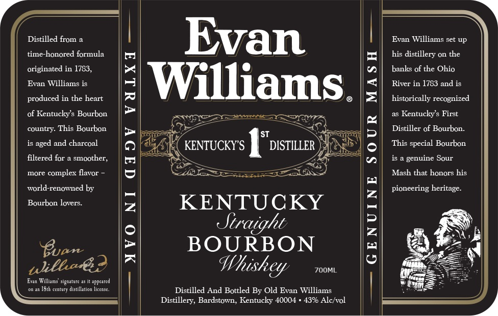
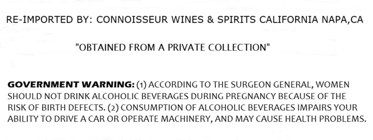

# TTB COLA Label Images - TTBID 26133001000742

**Brand Name:** EVAN WILLIAMS

**Issue Date:** 05/20/2026

**Origin Code:** 22

**Product Class/Type:** 101

**Source:** [TTB Public COLA Registry](https://ttbonline.gov/colasonline/viewColaDetails.do?action=publicFormDisplay&ttbid=26133001000742)

## Label Images

### Back Label

### Label 2

## Extracted Label Text

*Text extracted via OCR - may contain errors*

**Detected Proof:** 86

### Back Label

Distilled from
Evan
Evan Williams set up
time-honored formula
his distillery on the
originated in 1783,
banks of the Ohio
Evan Williams is
[Williams  |
River in 1783 and is
produced in the heart
historically
recognized
of Kentuckys Bourbon
Kentuckys First
country: This Bourbon
Distiller of Bourbon:
and charcoal
KENTUCKYS
(STDISTILLER
3
This special Bourbon
filtered for
smoother;
5
0
genuine Sour
more
complex flavor
Mash that
his
world-renowned by
pioneering heritage
Bourbon lovers:
2
KENTUCKY
Buan
2
BOURBON
1
Whiskey
ZOOML
Evan Walliams' signature
eppeared
I8th century distillation license
Distilled And Bottled By Old Evan Williams
Distillery, Bardstown, Kentucky 40004
43% Alc/vol
aged
honors
ulilha€3

### Label 2

RE-IMPORTED BY: CONNOISSEUR WINES & SPIRITS CALIFORNIA NAPA,CA

"OBTAINED FROM A PRIVATE COLLECTION"

GOVERNMENT WARNING: (1) ACCORDING TO THE SURGEON GENERAL, WOMEN

SHOULD NOT DRINK ALCOHOLIC BEVERAGES DURING PREGNANCY BECAUSE OF THE

RISK OF BIRTH DEFECTS. (2) CONSUMPTION OF ALCOHOLIC BEVERAGES IMPAIRS YOUR

ABILITY TO DRIVE A CAR OR OPERATE MACHINERY, AND MAY CAUSE HEALTH PROBLEMS.
