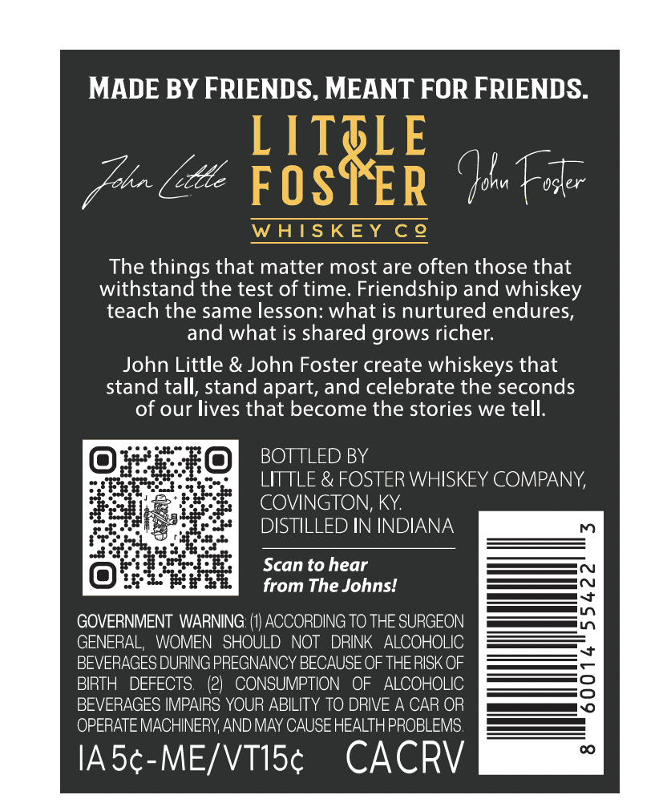
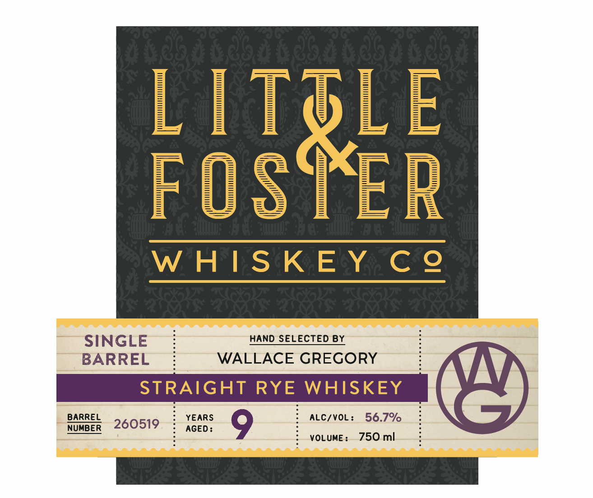
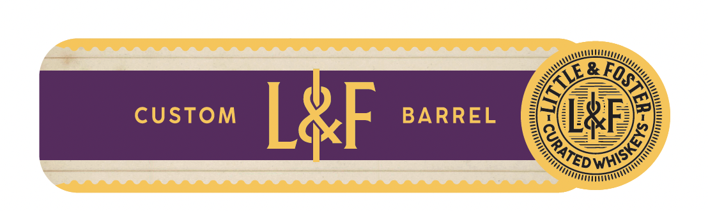

# TTB COLA Label Images - TTBID 26133001000775

**Brand Name:** LITTLE & FOSTER WHISKEY CO

**Fanciful Name:** SINGLE BARREL

**Issue Date:** 05/20/2026

**Origin Code:** 22

**Product Class/Type:** 102

**Source:** [TTB Public COLA Registry](https://ttbonline.gov/colasonline/viewColaDetails.do?action=publicFormDisplay&ttbid=26133001000775)

## Label Images

### Back Label

### Front Label

### Label 3

## Extracted Label Text

*Text extracted via OCR - may contain errors*

**Detected Proof:** 113.4

### Back Label

MADE BY FRIENDS, MEANT FOR FRIENDS.

fur (lls Con Fer

The things that matter most are often those that
withstand the test of time. Friendship and whiskey
teach the same lesson: what is nurtured endures,
and what is shared grows richer.

John Little & John Foster create whiskeys that
stand tall, stand apart, and celebrate the seconds
of our lives that become the stories we tell.

BOTTLED BY

LITTLE & FOSTER WHISKEY COMPANY,
COVINGTON, KY.

DISTILLED IN INDIANA

Scan to hear
from The Johns!

GOVERNMENT WARNING: (1) ACCORDING TO THE SURGEON
GENERAL, WOMEN SHOULD NOT DRINK ALCOHOLIC
BEVERAGES DURING PREGNANCY BECAUSE OF THE RISK OF
BIRTH DEFECTS. (2) CONSUMPTION OF ALCOHOLIC
BEVERAGES IMPAIRS YOUR ABILITY TO DRIVE A CAR OR
OPERATE MACHINERY, AND MAY CAUSE HEALTH PROBLEMS.

IA5¢-ME/VT15¢ CACRV

### Front Label

FOSTEE
W HIS KEY C @
SINGLE
HAND SELECTED BY
BARREL
WALLACE GREGORY
STRAIGHT RYE
WHISKEY
BARREL
YEARS
ALC/VOL :
56.7%
NUMBER
260519
AGED :
0
VOLUME :
750 ml

### Label 3

&
CUstom
LAF
BARREL
El
)
TTLE
CURATED
1
