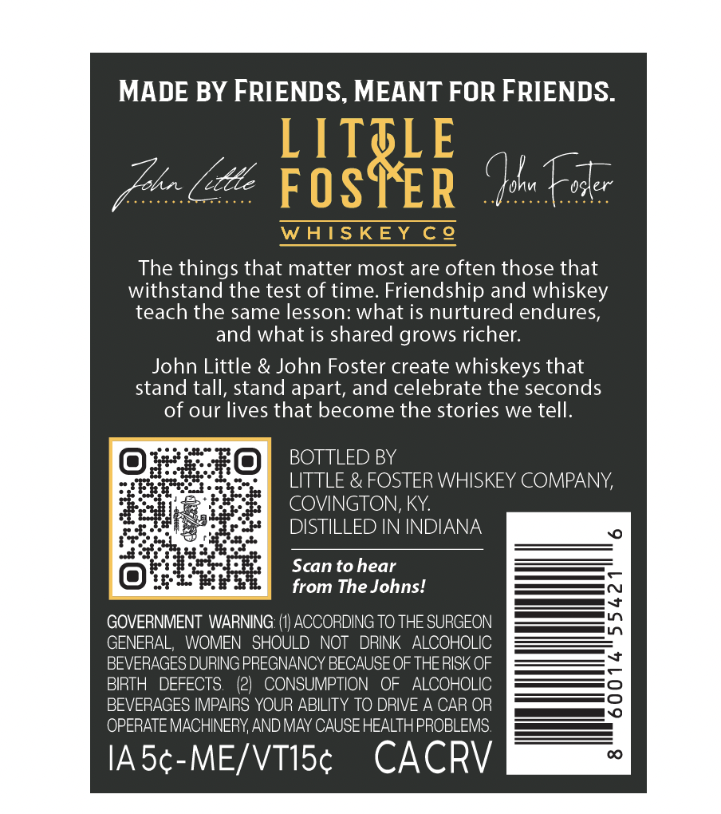
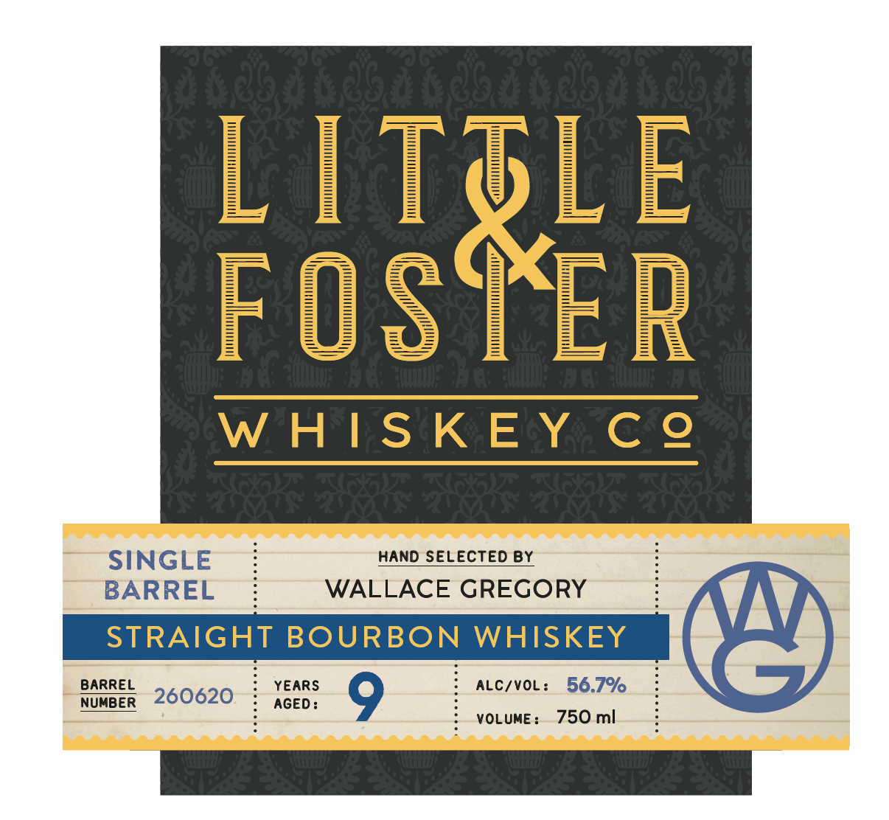
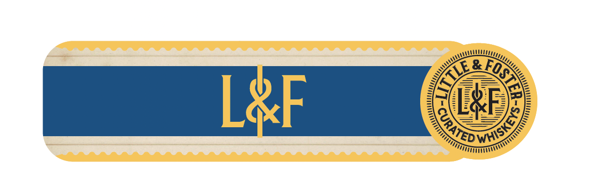

# TTB COLA Label Images - TTBID 26133001000776

**Brand Name:** LITTLE & FOSTER WHISKEY CO

**Fanciful Name:** SINGLE BARREL

**Issue Date:** 05/20/2026

**Origin Code:** 22

**Product Class/Type:** 101

**Source:** [TTB Public COLA Registry](https://ttbonline.gov/colasonline/viewColaDetails.do?action=publicFormDisplay&ttbid=26133001000776)

## Label Images

### Back Label

### Front Label

### Label 3

## Extracted Label Text

*Text extracted via OCR - may contain errors*

*1 image(s) excluded: text did not meet readability threshold*

**Detected Proof:** 113.4

### Back Label

MADE BY FRIENDS, MEANT FOR FRIENDS.
LTTLE
Iah
"cde
FOSTER
(sku kszer
WAISKEY Ce
The things that matter most are often those that
withstand the test of time: Friendship and whiskey
teach the same lesson: what is nurtured endures;
and what is shared grows richer:
John Little & John Foster create whiskeys that
stand tall, stand apart, and celebrate the seconds
of our lives that become the stories we tell:
BOTTLED BY
LITTLE & FOSTER WHISKEY COMPANY;
COVINGTON, KY:
DISTILLED IN INDIANA
Scan to hear
from The Johns!
GOVERNMENT WARNING:
ACCORDING TO THE SURGEON
GENERAL;
WOMEN   SHOULD NOT
DRINK
ALCOHOLIC
BEVERAGES DURING PREGNANCY BECAUSE OF THERISK OF
BIRTH
DEFECTS:
(21
CONSUMPTION
OF
ALCOHOLIC
BEVERAGES IMPAIRS YOUR ABILITY TO DRIVE A CAR OR
OPERATE MACHINERY AND MAY CAUSE HEALTHPROBLEMS:
IASc-ME/VTISc
CACRV

### Front Label

FISSEE
W HIS KE Y C @
SINGLE
HAND SELECTED By
BARREL
WALLACE GREGORY
STRAIGHT BOURBON WHISKEY
BARREL
YEARS
ALC/VOL:
56.7%
NUMBER
260620
AGED :
VOLUME :
750 ml
