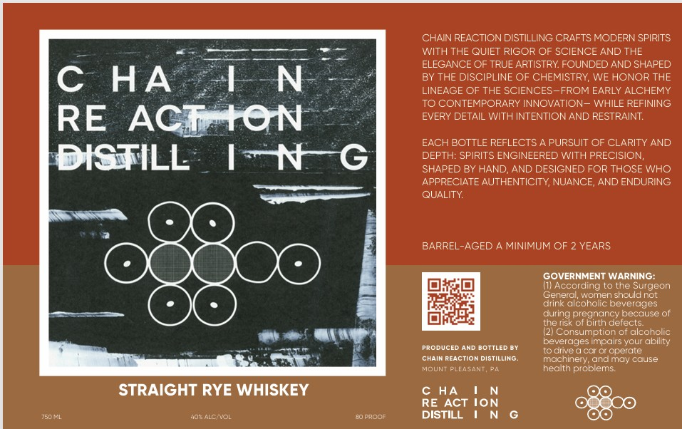

# TTB COLA Label Images - TTBID 26133001000830

**Brand Name:** CHAIN REACTION DISTILLING

**Issue Date:** 05/18/2026

**Origin Code:** 39

**Product Class/Type:** 102

**Source:** [TTB Public COLA Registry](https://ttbonline.gov/colasonline/viewColaDetails.do?action=publicFormDisplay&ttbid=26133001000830)

## Label Images

### Label 1

## Extracted Label Text

*Text extracted via OCR - may contain errors*

**Detected Age:** 2 Years

### Label 1

CHAIN REACTION DISTILLING CRAFTS MODERN SPIRITS
WITH THE QUIET RIGOR OF SCIENCE AND THE
ELEGANCE OF TRUE ARTISTRY FOUNDED AND SHAPED
C
HA
L N
BY THE DISCIPLINE OF CHEMISTRY WE HONOR THE
LINEAGE OF THE SCIENCES-FROM EARLY ALCHEMY
TO CONTEMPORARY INNOVATION =
WHILE REFINING
RE
ACiatON
EVERY DETAIL WITH INTENTIONAND RESTRAINT
EACH BOTTLE REFLECTS
PURSUIT OF CLARITY AND
DISTILL
1N
DEPTH: SPIRITS ENGINEERED WITH PRECISION;
SHAPED BY HAND_
AND DESIGNED FOR THOSE WHO
APPRECIATE AUTHENTICITY, NUANCE, AND ENDURING
QUALITY
BARREL-AGED
MINIMUM OF 2 YEARS
GOVERNMENT WARNING:
(1) According to the Surgeon
Ceneral
women should not
drink alcoholic beverages
during pregnancy because of
the risk ot birth detects
Consumption of alcoholic
beverages impairs your abilty
PRODUCED AND DOTTLED BY
Toolive
car Or operate
ChAIm REACTION DISTILLING
machinery, andmay couse
MOUNI
PLEACANT
health problems:
STRAIGHT RYE WHISKEY
C HA
RE ACT
{on
Js0mi
402 ALCIVOL
@OPROOR
DISTILL
