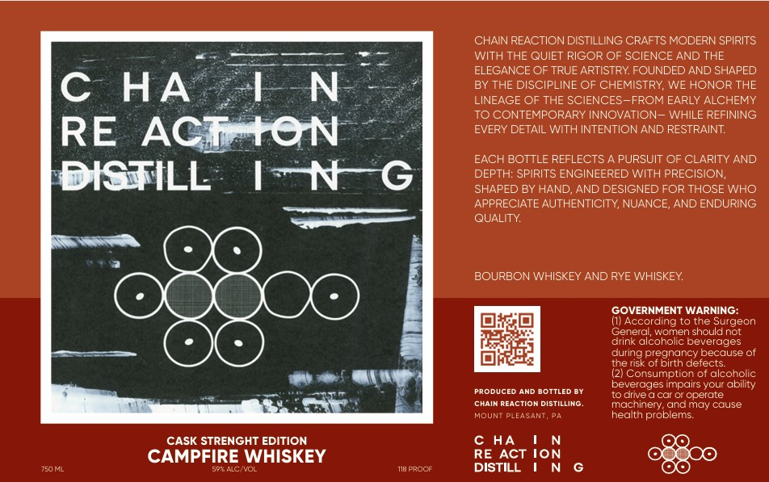

# TTB COLA Label Images - TTBID 26133001000833

**Brand Name:** CHAIN REACTION DISTILLING

**Fanciful Name:** CAMPFIRE WHISKEY

**Issue Date:** 06/10/2026

**Origin Code:** 39

**Product Class/Type:** 140

**Source:** [TTB Public COLA Registry](https://ttbonline.gov/colasonline/viewColaDetails.do?action=publicFormDisplay&ttbid=26133001000833)

## Label Images

### Label 1

## Extracted Label Text

*Text extracted via OCR - may contain errors*

### Label 1

CHAIN REACTION DISTILLING CRAFTS MODERN SPIRITS
WITH THE QUIET RIGOR OF SCIENCE AND THE
ELEGANCE OF TRUE ARTISTRY FOUNDED AND SHAPED
C
HA
LN
BY THE DISCIPLINE OF CHEMISTRY; WE HONOR THE
LINEAGE OF THE SCIENCES-FROM EARLY ALCHEMY
TO CONTEMPORARY INNOVATION_ WHILE REFINING
RE
ACIATON
EVERY DETAIL WITH INTENTIONAND RESTRAINT:
EACH BOTTLE REFLECTS
PURSUIT OF CLARITY AND
DISTILL
IN
DEPTH: SPIRITS ENGINEERED WITH PRECISION,
SHAPED BY HAND
AND DESIGNED FOR THOSE WHO
APPRECIATE AUTHENTICITY; NUANCE; AND ENDURING
QUALITY
BOURBON WHISKEY AND RYE WHISKEY
GOVERNMENT WARNING:
(1 According to the Surgeon
Genera; women should not
drink alcoholic beverages
during
(pregindnce
because of
the risk of E
defects:
(2) Consumption of alcoholic
Producec
AND BOTTLED BY
beverages impairs your ability
to drive
car @r operate
CHAIN REACTION DISTILLING
machinery; andmay cause
MOUNT PLEASANT, Pa
health problems:
CASK STRENGHT EDITION
c HA
CAMPFIRE WHISKEY
RE ACT ION
7SJML
598 Ae VOL
718 Ppocr
DISTILL
