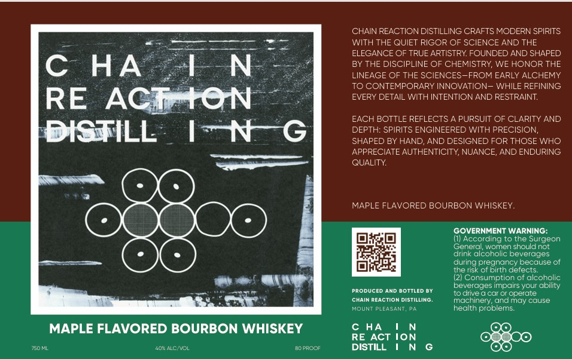

# TTB COLA Label Images - TTBID 26133001000839

**Brand Name:** CHAIN REACTION DISTILLING

**Issue Date:** 05/29/2026

**Origin Code:** 39

**Product Class/Type:** 149

**Source:** [TTB Public COLA Registry](https://ttbonline.gov/colasonline/viewColaDetails.do?action=publicFormDisplay&ttbid=26133001000839)

## Label Images

### Label 1

## Extracted Label Text

*Text extracted via OCR - may contain errors*

### Label 1

CHAIN REACTION DISTILLING CRAFTS MODERN SPIRITS
WITH THE QUIET RIGOR OF SCIENCE AND THE
ELEGANCE OF TRUE ARTISTRY FOUNDED AND SHAPED
C
HA
1 N
BY THE DISCIPLINE OF CHEMISTRY WE HONOR THE
LINEAGE OF THE SCIENCES-FROM EARLY ALCHEMY
TO CONTEMPORARY INNOVATION _ WHILE REFINING
RE
ACitON
EVERY DETAIL WITH INTENTION AND RESTRAINT
EACH BOTTLE REFLECTS A PURSUIT OF CLARITY AND
DISTILL
1N
G
DEPTH: SPIRITS ENGINEERED WITH PRECISION,
SHAPED BY HAND, AND DESIGNED FOR THOSE WHO
APPRECIATE AUTHENTICITY, NUANCE,; AND ENDURING
QUALITY
MAPLE FLAVORED BOURBON WHISKEY.
GOVERNMENT WARNING:
(I} According to the Surgeon
General
women should not
drink alcoholic beverages
during pregnancy because of
the risk of birth defects_
(21 Consumption of alcoholic
beverages impairs YoUr
PRODUCED AND BOTTLED BY
drive
car 0r operate
ChAIN ReACTION DISTILLING
machinery; andmay cause
MOUNT PLEASANT
health
eis:
MAPLE FLAVORED BOURBON WHISKEY
c HA
Ion
RE ACT
YS0ML
40" ALCNVOL
BD PRCOF
DISTILL
ability
proble
