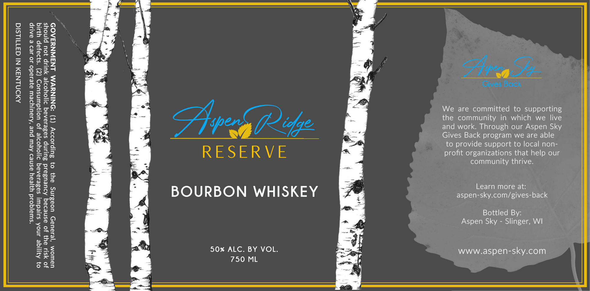

# TTB COLA Label Images - TTBID 26133001000855

**Brand Name:** ASPEN RIDGE

**Issue Date:** 05/18/2026

**Origin Code:** 48

**Product Class/Type:** 101

**Source:** [TTB Public COLA Registry](https://ttbonline.gov/colasonline/viewColaDetails.do?action=publicFormDisplay&ttbid=26133001000855)

## Label Images

### Label 1

## Extracted Label Text

*Text extracted via OCR - may contain errors*

**Detected Proof:** 100

### Label 1

Gives Back

ANDNLNAM NI GATIULSIG

We are committed to supporting

, : the community in which we live
peels (72 tye and work. Through our Aspen Sky
Q 5 — Gives Back program we are able

to provide support to local non-

R E S E R V E profit organizations that help our

community thrive.

BOURBON WHISKEY Egg aspenceky en ae

Bottled By:
Aspen Sky - Slinger, WI

“swiajqoid yijeay asned Aew pue ‘Asauiysew azeJado Jo Je2 e BALIpP

0} Azjiqe 4noA ssjedw sa8eiaraq d1j0Yyor]e Jo UuoWduINsUOD (Z) ‘s}2EJap Y WIG

JO SIU ay} JO asnedaq AdUeUsZaId BulINp sasesaAaq D1jOYyorje yULIp OU pjnoys
UaWIOM ‘je4aUID UOasINS 94} 0} BuIpsOd>y (T) ‘ONINUYVM LN3WNYSAOD

50% ALC. BY VOL. b~ =o www.aspen-sky.com
750 ML
