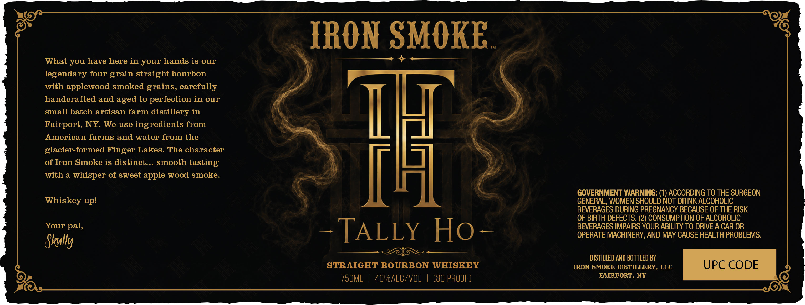

# TTB COLA Label Images - TTBID 26134001000050

**Brand Name:** TALLY HO

**Issue Date:** 06/11/2026

**Origin Code:** 02

**Product Class/Type:** 101

**Source:** [TTB Public COLA Registry](https://ttbonline.gov/colasonline/viewColaDetails.do?action=publicFormDisplay&ttbid=26134001000050)

## Label Images

### Label 1

### Label 2

## Extracted Label Text

*Text extracted via OCR - may contain errors*

*1 image(s) excluded: text did not meet readability threshold*

**Detected Proof:** 80

### Label 1

IRON SMOKE

Ay
What you have here in your hands is our
legendary four grain straight bourbon

with
applewood smoked grains, carefully
handcrafted and aged to perfection in our

small batch artisan farm distillery in
Ll
Fairport, NY. We use ingredients from
American farms and water from the
cruten Sxolee s digt_cakegmGbe chstioter
#H
with a
whisper of sweet apple wood smoke
GOVERNMENT WARNING:
ACCORDING TO THE SURGEON
Whiskey up!
GENERAL, WOMEN SHOULD NOT DRINK ALCOHOLIC
BEVERAGES DURING PREGNANCY BECAUSE OF THE RISK
OF BIRTH DEFECTS. (2) CONSUMPTION OF ALCOHOLIC
Your pal,
TALLY
Ho
BEVERAGES IMPAIRS YOUR ABILITY TO DRIVE A CAR OR
OPERATE MACHINERY, AND MAY CAUSE HEALTH PROBLEMS:
Skully
DISTILLED AND BOTTLED BY
STRAIGHT BOURBON WHISKEY
IRON SMOKE DISTILLERY, LLC
UPC CODE
75OML
40VALC/VOL
(80 PROOF)
FAIRPORT, NY
EFL
FFL
