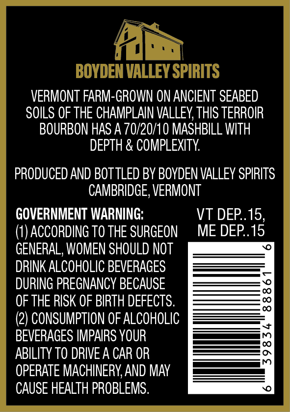
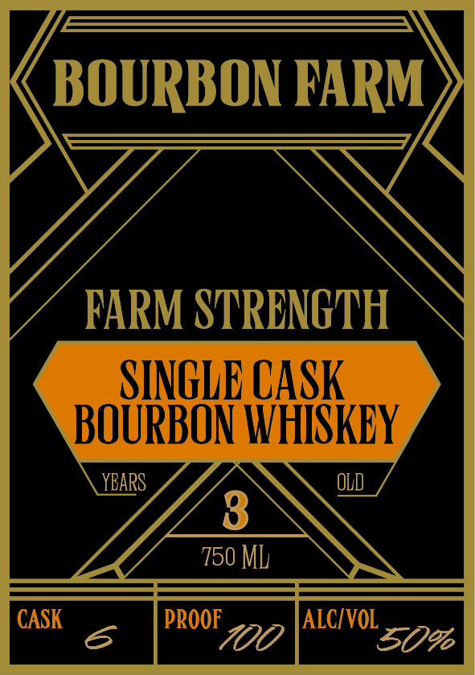

# TTB COLA Label Images - TTBID 26134001000077

**Brand Name:** BOURBON FARM

**Fanciful Name:** FARM STRENGTH SINGLE CASK

**Issue Date:** 05/22/2026

**Origin Code:** 46

**Product Class/Type:** 141

**Source:** [TTB Public COLA Registry](https://ttbonline.gov/colasonline/viewColaDetails.do?action=publicFormDisplay&ttbid=26134001000077)

## Label Images

### Back Label

### Front Label

## Extracted Label Text

*Text extracted via OCR - may contain errors*

### Back Label

VERMONT FARM-GROWN ON ANCIENT SEABED

SOILS OF THE CHAMPLAIN VALLEY, THIS TERROIR

BOURBON HAS A 70/20/10 MASHBILL WITH

DEPTH & COMPLEXITY.

PRODUCED AND BOTTLED BY BOYDEN VALLEY SPIRITS

CAMBRIDGE, VERMONT

GOVERNMENT WARNING:

VT DEP..15,

(1) ACCORDING TO THE SURGEON

ME DEP..15

GENERAL, WOMEN SHOULD NOT

DRINK ALCOHOLIC BEVERAGES

DURING PREGNANCY BECAUSE

OF THE RISK OF BIRTH DEFECTS.

(2) CONSUMPTION OF ALCOHOLIC

BEVERAGES IMPAIRS YOUR

_——————————

ee

ABILITY TO DRIVE A CAR OR

a

OPERATE MACHINERY, AND MAY

CAUSE HEALTH PROBLEMS.

### Front Label

BOURBON FARM
FarM STRENOTVH
SINGLE CASk
BOURBON WHISKEY
YBAPS
OLD
8
750 ML
CASK
PROOF
ALCIVOL
700
30%6
