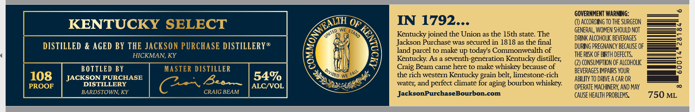
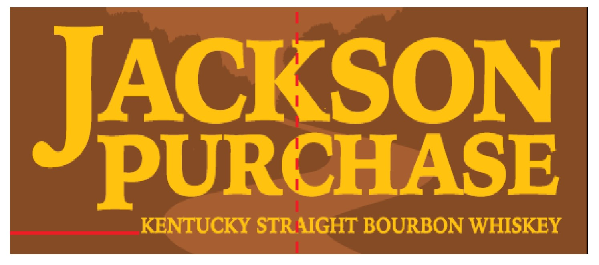

# TTB COLA Label Images - TTBID 26134001000121

**Brand Name:** JACKSON PURCHASE

**Issue Date:** 05/19/2026

**Origin Code:** 22

**Product Class/Type:** 101

**Source:** [TTB Public COLA Registry](https://ttbonline.gov/colasonline/viewColaDetails.do?action=publicFormDisplay&ttbid=26134001000121)

## Label Images

### Label 1

### Label 2

### Label 3

## Extracted Label Text

*Text extracted via OCR - may contain errors*

*1 image(s) excluded: text did not meet readability threshold*

**Detected Proof:** 108

### Label 1

GOVERNMENT WARNING:
KENTUCKY SELECT
IN 1792._
ACcORDING TO ThE SURGEON
GENERAL, WOMEN SHOULD NOT
Kentucky joined the Union as the ISth state. The
DRINK ALCOHOLIC BEVERAGES
DISTILLED & AGED BY THE JACKSON PURCHASE DISTILLERY@
Jackson Purchase was secured in 1818 as the final
DURING PREGNANCY BECAuSE OF
land parcel to make up todays Commonwealth of
THE RISK OF EIRTH DEFECTS;
HICKMAN,
KY
3
Kentucky As a seventh-generation Kentucky distiller;
BOTTLED BY
MASTER DISTILLER
Craig Beam came here to make whiskey because of
CONSUMPTION OF ALcoHOLIc
8
Faly
BEVERAGES IMPAIRS YOUR
108
JACKSON PURCHASE
54%
the rich western Kentucky
belt; limestone-rich
ABILITY TO DRIVE A CAR OR
PROOF
DISTILLERY
Bu
ALCIVOL
water; and
perfect climate for aging bourbon whiskey:
OPERATE MACHINERY; AND MAY
BARDSTOWN, KY
CRAIG BEAM
JacksonPurchaseBourbon.com
CAUSE HeALTH PROBLEMS
750 ML
ONWEALIH
9
umTED
STAND
Divideo `
6
4nk
grain

### Label 2

PURCHASE
KENTUCKY STRAIGHT BOURBON WHISKEY
JACKSON
