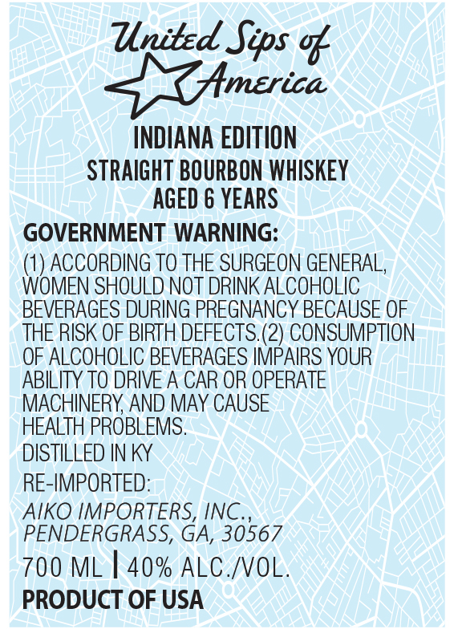

# TTB COLA Label Images - TTBID 26134001000256

**Brand Name:** UNITED SIPS OF AMERICA

**Fanciful Name:** INDIANA EDITION

**Issue Date:** 05/19/2026

**Origin Code:** 08

**Product Class/Type:** 101

**Source:** [TTB Public COLA Registry](https://ttbonline.gov/colasonline/viewColaDetails.do?action=publicFormDisplay&ttbid=26134001000256)

## Label Images

### Front Label

## Extracted Label Text

*Text extracted via OCR - may contain errors*

**Detected Proof:** 80

### Front Label

United Sips %
Hmerica
INDIANA EDITION
STRAIGHT BOURBON WHISKEY
AGED & YEARS
GOVERNMENT WARNING:
ACCORDING TO THE SURGEON GENERAL,
WOMEN SHOULD NOT DRINK ALCOHOLIC
BEVERAGES DURING PREGNANCY BECAUSE OF
THE RISK OF BIRTH DEFECTS. (2) CONSUMPTION
OF ALCOHOLIC BEVERAGES IMPAIRS YOUR
ABILITY TO DRIVE A CAR OR OPERATE
MACHINERY AND MAY CAUSE
HEALTH PROBLEMS.
DISTILLED IN KY
RE-IMPORTED:
AIKO IMPORTERS, INC.
PENDERGRASS, GA, 30567
700 ML
40% ALC /VOL.
PRODUCT OF USA
